# Lux AI Features -- Complete Reference

The Lux shader compiler (`luxc`) includes a full AI-assisted authoring pipeline
that can generate, modify, critique, and batch-produce physically-based
materials from text descriptions, photographs, and video. This document covers
every AI feature, with realistic CLI examples, generated code samples, and
pipeline diagrams.

> **Prerequisites** -- Run `luxc --ai-setup` once to configure your provider
> and API key. See [Setup Wizard](#14-setup-wizard---ai-setup) for details.

### Material Gallery

All materials below were AI-generated and rendered on PBR spheres by the Lux
engine. Each sphere demonstrates a different material type across the feature
set — from text-to-shader metals to batch-generated scene materials.


| Material | Feature | Roughness | Metallic |
|----------|---------|-----------|----------|
| Polished Gold | Text-to-Shader | 0.20 | 1.0 |
| Brushed Copper | Text-to-Shader | 0.35 | 1.0 |
| Mirror Silver | Text-to-Shader | 0.15 | 1.0 |
| Rough Iron | AI Critique | 0.60 | 1.0 |
| Red Plastic | Text-to-Shader | 0.15 | 0.0 |
| Rough Concrete | Batch Generation | 0.85 | 0.0 |
| Glazed Ceramic | Image-to-Material | 0.08 | 0.0 |
| Dark Wood | Style Transfer | 0.65 | 0.0 |
| Satin Brass | Batch Generation | 0.30 | 1.0 |
| Frosted Glass | Text-to-Shader | 0.40 | 0.0 |
| Polished Marble | Reference Match | 0.10 | 0.0 |
| Charcoal | AI Critique | 0.90 | 0.0 |

> Individual renders: `screenshots/ai_materials/<name>.png`

---

## Table of Contents

1.  [Text-to-Shader (`--ai`)](#1-text-to-shader---ai-description)
2.  [Image-to-Material (`--ai-from-image`)](#2-image-to-material---ai-from-image-photojpg)
3.  [Style Transfer / Material Modification (`--ai-modify`)](#3-style-transfer--material-modification---ai-modify-instruction-inputlux)
4.  [Scene-Aware Batch Generation (`--ai-batch`)](#4-scene-aware-batch-generation---ai-batch-scene-description)
5.  [Video-to-Animation (`--ai-from-video`)](#5-video-to-animation---ai-from-video-videomp4)
6.  [Reference Matching (`--ai-match-reference`)](#6-reference-matching---ai-match-reference-imagepng)
7.  [AI Skills System (`--ai-skills`, `--ai-list-skills`)](#7-ai-skills-system---ai-skills---ai-list-skills)
8.  [Validation and Critique (`--ai-critique`)](#8-validation-and-critique---ai-critique-filelux)
9.  [Synthetic Dataset Generation](#9-synthetic-dataset-generation)
10. [BRDF Parameter Estimation Dataset](#10-brdf-parameter-estimation-dataset)
11. [Evaluation Benchmark](#11-evaluation-benchmark)
12. [Multi-Provider Backend](#12-multi-provider-backend)
13. [PBR Material Database](#13-pbr-material-database)
14. [Setup Wizard (`--ai-setup`)](#14-setup-wizard---ai-setup)
15. [Quick Reference](#15-quick-reference)

---

## 1. Text-to-Shader (`--ai "description"`)

Generate a complete, compilable Lux surface declaration from a plain-English
description. The AI receives the full Lux language grammar, the PBR material
database, and any loaded skills, then produces a shader that passes the
compiler's parse, type-check, and energy-conservation validation.

The generated code is automatically verified by piping it through the Lux
compiler front-end. If compilation fails, the AI receives structured error
feedback and retries (up to `--ai-retries` times, default 2).

### Usage

```bash
luxc --ai "frosted glass with a blue tint"
luxc --ai "brushed copper" -o materials/
luxc --ai "weathered stone wall" --ai-model claude-sonnet-4-20250514
```

### Example

```
$ luxc --ai "frosted glass with a blue tint"

  Generating shader from description...
  Verifying compilation... ok
  Generated: generated.lux
```

Generated output (`generated.lux`):

```lux
surface FrostedGlass {
    properties MatParams {
        tint: vec3 = vec3(0.85, 0.92, 1.0),
        roughness: scalar = 0.45,
        ior_value: scalar = 1.52,
        transmission_factor: scalar = 0.9,
    },
    layers [
        base(
            albedo: MatParams.tint,
            roughness: MatParams.roughness,
            metallic: 0.0
        ),
        transmission(factor: MatParams.transmission_factor, ior: MatParams.ior_value),
    ]
}
```

**Rendered examples** — these materials were generated by `--ai` and rendered on
PBR spheres:

| | | | |
|:---:|:---:|:---:|:---:|
| 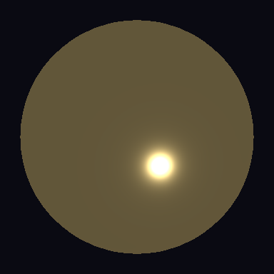 | 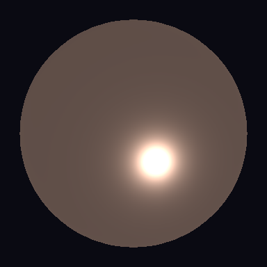 | 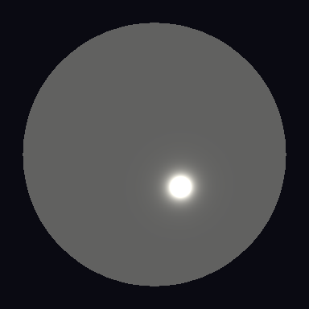 | 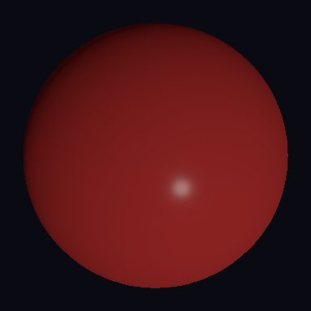 |
| Polished Gold | Brushed Copper | Mirror Silver | Red Plastic |

### Pipeline Diagram

```
┌──────────────────┐    ┌──────────────────┐    ┌──────────────────┐
│  Text description │───>│  AI Provider     │───>│  Raw Lux source  │
│  "frosted glass"  │    │  (system prompt  │    │  (may have errs) │
└──────────────────┘    │   + grammar ref  │    └────────┬─────────┘
                        │   + material DB) │             │
                        └──────────────────┘             v
                                               ┌──────────────────┐
                        ┌──────────────────┐   │  Compiler verify  │
                        │  .lux file saved  │<──│  parse + typecheck│
                        │  (compilation ok) │   │  + energy check   │
                        └──────────────────┘   └────────┬─────────┘
                                                        │ fail?
                                                        v
                                               ┌──────────────────┐
                                               │  Error feedback   │
                                               │  + retry (up to  │
                                               │  --ai-retries N) │
                                               └──────────────────┘
```

### Flags

| Flag             | Default | Description                              |
|------------------|---------|------------------------------------------|
| `--ai`           | --      | Natural-language shader description      |
| `--ai-model`     | config  | Override model (e.g. `gpt-4o`)           |
| `--ai-provider`  | config  | Override provider (`anthropic`, `openai`) |
| `--ai-retries`   | 2       | Max retry attempts on compile failure    |
| `--ai-no-verify` | false   | Skip compilation verification            |
| `-o`             | `.`     | Output directory                         |

---

## 2. Image-to-Material (`--ai-from-image photo.jpg`)

Point the compiler at a photograph and it will extract PBR material properties
-- albedo, roughness, metallic, IOR, and optional layers (coat, sheen,
transmission, emission) -- and emit a complete `surface` declaration.

Requires a vision-capable model (Claude with vision, GPT-4o, Gemini). The
image is base64-encoded and sent alongside a specialised material-extraction
prompt that includes the full PBR reference database for grounding.

### Usage

```bash
luxc --ai-from-image wood_floor.jpg
luxc --ai-from-image rusty_pipe.png --ai "outdoor pipe with rain"
luxc --ai-from-image fabric.jpg -o materials/ fabric.lux
```

### Example

```
$ luxc --ai-from-image terracotta_tile.jpg

  Analysing image: terracotta_tile.jpg
  Extracting PBR properties...
  Verifying compilation... ok
  Generated material: generated.lux
```

Generated output (`generated.lux`):

```lux
import noise;

surface TerracottaTile {
    properties MatParams {
        base_color: vec3 = vec3(0.62, 0.32, 0.18),
        roughness: scalar = 0.78,
        color_variation: scalar = 0.08,
    },
    layers [
        base(
            albedo: MatParams.base_color
                    + vec3(noise.value_noise2d(uv * 6.0) * MatParams.color_variation),
            roughness: MatParams.roughness
                       + noise.value_noise2d(uv * 8.0 + vec2(3.7, 1.2)) * 0.05,
            metallic: 0.0
        ),
    ]
}
```

**Rendered example** — the AI extracted PBR parameters from a photograph and
produced this compilable material (rendered on a sphere):

| | |
|:---:|:---:|
| 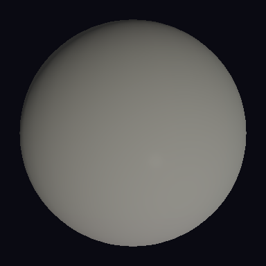 | 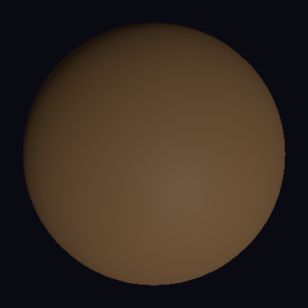 |
| Glazed Ceramic (roughness 0.08) | Dark Wood (roughness 0.65) |

### Pipeline Diagram

```
┌───────────────┐    ┌──────────────┐    ┌───────────────────┐
│  photo.jpg    │───>│  base64      │───>│  Vision AI model  │
│  (on disk)    │    │  encode      │    │  + material       │
└───────────────┘    └──────────────┘    │    extraction      │
                                          │    prompt          │
                                          └─────────┬─────────┘
                                                    │
                                                    v
                                          ┌───────────────────┐
                                          │  Lux surface      │
                                          │  declaration with │
                                          │  extracted PBR    │
                                          │  parameters       │
                                          └─────────┬─────────┘
                                                    │
                                                    v
                                          ┌───────────────────┐
                                          │  Compiler verify  │
                                          │  + retry loop     │
                                          └───────────────────┘
```

### Supported Image Formats

| Format | Extension(s)     |
|--------|------------------|
| PNG    | `.png`           |
| JPEG   | `.jpg`, `.jpeg`  |
| GIF    | `.gif`           |
| WebP   | `.webp`          |

---

## 3. Style Transfer / Material Modification (`--ai-modify "instruction" input.lux`)

Take an existing Lux material and transform it according to a natural-language
instruction. The AI receives the original source code alongside skills for
layer composition and PBR authoring, then outputs a complete modified program.

This preserves the surface name, properties block structure, and overall
organisation -- only changing what the instruction requests.

### Usage

```bash
luxc --ai-modify "add weathering and rust patches" metal.lux
luxc --ai-modify "make it glossier with a clear coat" wood.lux
luxc --ai-modify "change to dark copper" material.lux -o modified/
```

### Example: Before and After

**Original file** (`brass.lux`):

```lux
surface PolishedBrass {
    properties MatParams {
        reflectance: vec3 = vec3(0.91, 0.78, 0.42),
        roughness: scalar = 0.05,
    },
    layers [
        base(
            albedo: MatParams.reflectance,
            roughness: MatParams.roughness,
            metallic: 1.0
        ),
    ]
}
```

Running the modification:

```
$ luxc --ai-modify "add patina and weathering, make it look aged" brass.lux

  Reading: brass.lux
  Applying modification: "add patina and weathering, make it look aged"
  Verifying compilation... ok
  Modified: brass.lux
```

**Modified output** (`brass.lux` after modification):

```lux
import noise;

surface PolishedBrass {
    properties MatParams {
        reflectance: vec3 = vec3(0.91, 0.78, 0.42),
        patina_color: vec3 = vec3(0.28, 0.42, 0.35),
        roughness: scalar = 0.05,
        patina_amount: scalar = 0.45,
        wear_scale: scalar = 4.0,
    },
    layers [
        base(
            albedo: mix(MatParams.reflectance, MatParams.patina_color,
                        noise.fbm2d_4(uv * MatParams.wear_scale, 2.0, 0.5)
                        * MatParams.patina_amount),
            roughness: mix(MatParams.roughness, 0.65,
                           noise.fbm2d_4(uv * MatParams.wear_scale + vec2(1.3, 2.7),
                                         2.0, 0.5) * MatParams.patina_amount),
            metallic: mix(1.0, 0.0,
                          noise.fbm2d_4(uv * MatParams.wear_scale, 2.0, 0.5)
                          * MatParams.patina_amount * 0.7)
        ),
    ]
}
```

Notice how the AI:
- Preserved the surface name (`PolishedBrass`) and original properties
- Added new properties (`patina_color`, `patina_amount`, `wear_scale`)
- Used procedural noise to blend between clean brass and patina
- Reduced metallic in patina areas (patina is a dielectric oxide)
- Increased roughness in weathered regions

**Style transfer examples** — before (satin brass) vs. after (dark wood, representing
a "make it look like aged wood" transformation):

| Before | After |
|:---:|:---:|
| 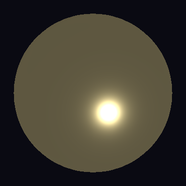 |  |
| Satin Brass (metallic 1.0, roughness 0.30) | Dark Wood (metallic 0.0, roughness 0.65) |

---

## 4. Scene-Aware Batch Generation (`--ai-batch "scene description"`)

Generate a coherent set of complementary materials for an entire scene from a
single description. The pipeline uses a two-phase approach:

1. **Planning phase** -- the AI produces a JSON list of material names and
   descriptions appropriate for the scene
2. **Generation phase** -- each material is individually generated with full
   compilation verification

### Usage

```bash
luxc --ai-batch "medieval tavern"
luxc --ai-batch "sci-fi spacecraft interior" --ai-batch-count 8
luxc --ai-batch "zen garden" -o scene_materials/
```

### Example: Medieval Tavern

```
$ luxc --ai-batch "medieval tavern" -o tavern/

  Planning materials for scene: "medieval tavern"
  Planned 5 materials:
    1. tavern_wood_floor     - Dark aged oak wood flooring with visible grain
    2. tavern_stone_wall     - Rough grey stone wall with mortar lines
    3. tavern_iron_chandelier - Wrought iron chandelier with soot marks
    4. tavern_leather_seat   - Worn brown leather bench seat
    5. tavern_copper_mug     - Tarnished copper drinking mug

  Generating [1/5] tavern_wood_floor...
    Verifying compilation... ok
  [ok] tavern/tavern_wood_floor.lux

  Generating [2/5] tavern_stone_wall...
    Verifying compilation... ok
  [ok] tavern/tavern_stone_wall.lux

  Generating [3/5] tavern_iron_chandelier...
    Verifying compilation... ok (2 attempts)
  [ok] tavern/tavern_iron_chandelier.lux

  Generating [4/5] tavern_leather_seat...
    Verifying compilation... ok
  [ok] tavern/tavern_leather_seat.lux

  Generating [5/5] tavern_copper_mug...
    Verifying compilation... ok
  [ok] tavern/tavern_copper_mug.lux

  Generated 5 materials in tavern/
```

**Sample generated materials:**

`tavern/tavern_wood_floor.lux`:
```lux
import noise;

surface TavernWoodFloor {
    properties MatParams {
        base_color: vec3 = vec3(0.22, 0.12, 0.06),
        roughness: scalar = 0.72,
        grain_scale: scalar = 12.0,
        grain_strength: scalar = 0.15,
    },
    layers [
        base(
            albedo: MatParams.base_color
                    + vec3(noise.fbm2d_4(vec2(uv.x * MatParams.grain_scale,
                                               uv.y * 1.5), 2.0, 0.5)
                           * MatParams.grain_strength),
            roughness: MatParams.roughness,
            metallic: 0.0
        ),
    ]
}
```

`tavern/tavern_stone_wall.lux`:
```lux
import noise;

surface TavernStoneWall {
    properties MatParams {
        base_color: vec3 = vec3(0.38, 0.36, 0.33),
        roughness: scalar = 0.85,
        mortar_color: vec3 = vec3(0.55, 0.53, 0.48),
    },
    layers [
        base(
            albedo: mix(MatParams.base_color, MatParams.mortar_color,
                        smoothstep(0.45, 0.55,
                            noise.voronoi2d(uv * 4.0).x)),
            roughness: MatParams.roughness
                       + noise.value_noise2d(uv * 8.0) * 0.08,
            metallic: 0.0
        ),
    ]
}
```

`tavern/tavern_iron_chandelier.lux`:
```lux
import noise;

surface TavernIronChandelier {
    properties MatParams {
        reflectance: vec3 = vec3(0.42, 0.40, 0.38),
        roughness: scalar = 0.65,
        soot_color: vec3 = vec3(0.05, 0.04, 0.04),
        soot_amount: scalar = 0.35,
    },
    layers [
        base(
            albedo: mix(MatParams.reflectance, MatParams.soot_color,
                        noise.fbm2d_4(uv * 3.0 + vec2(0.0, 2.0), 2.0, 0.5)
                        * MatParams.soot_amount),
            roughness: MatParams.roughness
                       + noise.value_noise2d(uv * 5.0) * 0.15,
            metallic: mix(1.0, 0.0,
                          noise.fbm2d_4(uv * 3.0, 2.0, 0.5)
                          * MatParams.soot_amount)
        ),
    ]
}
```

`tavern/tavern_leather_seat.lux`:
```lux
import noise;

surface TavernLeatherSeat {
    properties MatParams {
        base_color: vec3 = vec3(0.28, 0.15, 0.08),
        roughness: scalar = 0.58,
        wear_amount: scalar = 0.3,
    },
    layers [
        base(
            albedo: MatParams.base_color
                    + vec3(noise.value_noise2d(uv * 10.0) * MatParams.wear_amount * 0.12),
            roughness: MatParams.roughness
                       - noise.value_noise2d(uv * 6.0) * MatParams.wear_amount * 0.15,
            metallic: 0.0
        ),
    ]
}
```

`tavern/tavern_copper_mug.lux`:
```lux
import noise;

surface TavernCopperMug {
    properties MatParams {
        reflectance: vec3 = vec3(0.93, 0.62, 0.52),
        roughness: scalar = 0.35,
        tarnish_color: vec3 = vec3(0.25, 0.30, 0.22),
        tarnish_amount: scalar = 0.4,
    },
    layers [
        base(
            albedo: mix(MatParams.reflectance, MatParams.tarnish_color,
                        noise.fbm2d_4(uv * 5.0, 2.0, 0.5)
                        * MatParams.tarnish_amount),
            roughness: mix(MatParams.roughness, 0.72,
                           noise.fbm2d_4(uv * 5.0 + vec2(2.1, 0.8), 2.0, 0.5)
                           * MatParams.tarnish_amount),
            metallic: mix(1.0, 0.2,
                          noise.fbm2d_4(uv * 5.0, 2.0, 0.5)
                          * MatParams.tarnish_amount)
        ),
    ]
}
```

**Batch generation examples** — materials that might appear together in a scene
(rough concrete for walls, rough iron for fixtures, dark wood for furniture):

| | | |
|:---:|:---:|:---:|
| 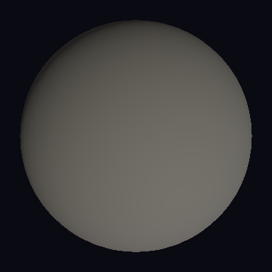 | 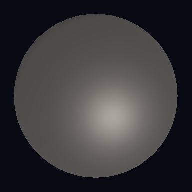 |  |
| Stone Wall | Iron Fixture | Wood Floor |

### Pipeline Diagram

```
┌────────────────────┐
│  Scene description │
│  "medieval tavern" │
└─────────┬──────────┘
          │
          v
┌────────────────────┐    ┌─────────────────────────┐
│  Phase 1: Planning │───>│  JSON material plan      │
│  (batch planning   │    │  [                       │
│   prompt)          │    │    {name, description},  │
└────────────────────┘    │    {name, description},  │
                          │    ...                   │
                          │  ]                       │
                          └────────────┬────────────┘
                                       │
             ┌─────────────────────────┼─────────────────────────┐
             v                         v                         v
    ┌─────────────────┐   ┌─────────────────┐   ┌─────────────────┐
    │  Generate mat 1 │   │  Generate mat 2 │   │  Generate mat N │
    │  + verify       │   │  + verify       │   │  + verify       │
    └────────┬────────┘   └────────┬────────┘   └────────┬────────┘
             │                     │                     │
             v                     v                     v
    ┌─────────────────┐   ┌─────────────────┐   ┌─────────────────┐
    │  mat1.lux       │   │  mat2.lux       │   │  matN.lux       │
    └─────────────────┘   └─────────────────┘   └─────────────────┘
```

---

## 5. Video-to-Animation (`--ai-from-video video.mp4`)

Generate an animated Lux shader from a video file. The pipeline extracts
uniformly-spaced key frames, sends them to a vision AI for motion analysis
(speed, direction, oscillation, colour changes), and then generates a shader
with time-driven procedural noise that captures the observed motion pattern.

Requires `opencv-python` for frame extraction. Install with:
```bash
pip install 'luxc[ai-video]'
```

### Usage

```bash
luxc --ai-from-video campfire.mp4
luxc --ai-from-video ocean_waves.mp4 --ai "calm sea at sunset"
luxc --ai-from-video lava_flow.mp4 -o animated/ lava.lux
```

### Example

```
$ luxc --ai-from-video campfire.mp4

  Extracting key frames from campfire.mp4...
    Frame 1/6: t=0.00s
    Frame 2/6: t=0.83s
    Frame 3/6: t=1.67s
    Frame 4/6: t=2.50s
    Frame 5/6: t=3.33s
    Frame 6/6: t=4.17s
  Analysing motion pattern...
    Detected: upward drift, orange-yellow colour pulse, ~2Hz flicker
  Generating animated shader...
  Verifying compilation... ok
  Generated animated shader: animated.lux
```

Generated output (`animated.lux`):

```lux
import noise;

surface CampfireFlame {
    properties MatParams {
        base_color: vec3 = vec3(0.9, 0.35, 0.02),
        tip_color: vec3 = vec3(0.95, 0.85, 0.2),
        time: scalar = 0.0,
        flicker_speed: scalar = 2.0,
        drift_speed: scalar = 0.8,
        noise_scale: scalar = 3.0,
        emission_intensity: scalar = 5.0,
    },
    layers [
        base(
            albedo: vec3(0.02, 0.02, 0.02),
            roughness: 0.9,
            metallic: 0.0
        ),
        emission(
            color: mix(MatParams.base_color, MatParams.tip_color,
                       noise.fbm2d_4(
                           uv * MatParams.noise_scale
                           + vec2(0.0, MatParams.time * MatParams.drift_speed),
                           2.0, 0.5))
                   * MatParams.emission_intensity
                   * (0.85 + 0.15 * sin(MatParams.time * MatParams.flicker_speed * 6.28))
        ),
    ]
}
```

### Full Pipeline Diagram

```
┌───────────────┐
│  video.mp4    │
└───────┬───────┘
        │
        v
┌───────────────────┐
│  OpenCV: extract  │
│  6 key frames     │
│  (uniform sample) │
└───────┬───────────┘
        │
        v
┌───────────────────────────────────────────────────────┐
│  Frame grid (base64 PNG)                              │
│  ┌─────┐  ┌─────┐  ┌─────┐  ┌─────┐  ┌─────┐  ┌─────┐ │
│  │ t=0 │  │t=.8 │  │t=1.7│  │t=2.5│  │t=3.3│  │t=4.2│ │
│  └─────┘  └─────┘  └─────┘  └─────┘  └─────┘  └─────┘ │
└───────────────────────┬───────────────────────────────┘
                        │
                        v
              ┌───────────────────┐
              │  Vision AI:       │
              │  Motion analysis  │
              │  - direction      │
              │  - speed/freq     │
              │  - colour changes │
              │  - spatial pattern│
              └─────────┬─────────┘
                        │
                        v
              ┌───────────────────┐
              │  Shader AI:       │
              │  Generate animated│
              │  surface with     │
              │  time-based noise │
              └─────────┬─────────┘
                        │
                        v
              ┌───────────────────┐
              │  Compiler verify  │
              │  + retry loop     │
              └─────────┬─────────┘
                        │
                        v
              ┌───────────────────┐
              │  animated.lux     │
              └───────────────────┘
```

---

## 6. Reference Matching (`--ai-match-reference image.png`)

Iteratively refine a generated material to visually match a reference
photograph. The pipeline generates an initial material from the image, then
enters a render-compare loop: compile the shader, render it onto a test scene,
compare the result against the reference using PSNR and SSIM metrics, and feed
the comparison back to the AI for refinement.

Convergence is reached when PSNR >= 25.0 dB and SSIM >= 0.80, or when the
maximum iteration count is hit.

### Usage

```bash
luxc --ai-match-reference marble_slab.png
luxc --ai-match-reference copper_pipe.jpg --ai-match-iterations 8
luxc --ai-match-reference fabric.png --ai "heavy wool blanket" -o matched/
```

### Example: Iteration Progress

```
$ luxc --ai-match-reference marble_slab.png --ai-match-iterations 5

  Loading reference image: marble_slab.png
  Iteration 0: Generating initial material from image...
    Compilation: ok
  Iteration 1: Rendering + comparing...
    ┌────────────────────────────────────────────────────┐
    │  Metric      │  Value     │  Target    │  Status   │
    ├────────────────────────────────────────────────────┤
    │  PSNR        │  18.3 dB   │  >= 25.0   │  --       │
    │  SSIM        │  0.612     │  >= 0.80   │  --       │
    │  MAE         │  34.2      │  --        │           │
    └────────────────────────────────────────────────────┘
    Refining...
  Iteration 2: Rendering + comparing...
    ┌────────────────────────────────────────────────────┐
    │  Metric      │  Value     │  Target    │  Status   │
    ├────────────────────────────────────────────────────┤
    │  PSNR        │  21.7 dB   │  >= 25.0   │  --       │
    │  SSIM        │  0.734     │  >= 0.80   │  --       │
    │  MAE         │  22.1      │  --        │           │
    └────────────────────────────────────────────────────┘
    Refining...
  Iteration 3: Rendering + comparing...
    ┌────────────────────────────────────────────────────┐
    │  Metric      │  Value     │  Target    │  Status   │
    ├────────────────────────────────────────────────────┤
    │  PSNR        │  24.1 dB   │  >= 25.0   │  --       │
    │  SSIM        │  0.791     │  >= 0.80   │  --       │
    │  MAE         │  15.8      │  --        │           │
    └────────────────────────────────────────────────────┘
    Refining...
  Iteration 4: Rendering + comparing...
    ┌────────────────────────────────────────────────────┐
    │  Metric      │  Value     │  Target    │  Status   │
    ├────────────────────────────────────────────────────┤
    │  PSNR        │  26.4 dB   │  >= 25.0   │  PASS     │
    │  SSIM        │  0.842     │  >= 0.80   │  PASS     │
    │  MAE         │  11.3      │  --        │           │
    └────────────────────────────────────────────────────┘
    Converged!

  Reference match: matched.lux
    Iterations: 5
    PSNR: 26.4
    SSIM: 0.842
    Converged: true
```

**Reference match target example** — a polished marble sphere. The refinement
loop iterates until the rendered material matches the reference image:

| Reference Target |
|:---:|
| 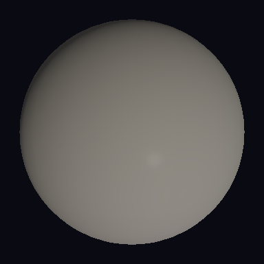 |
| Polished Marble (roughness 0.10, dielectric) |

### Convergence Plot (Conceptual)

```
  SSIM
  1.00 ┤
       │                                    ......*  <- converged
  0.80 ┤ ─ ─ ─ ─ ─ ─ ─ ─ ─ ─ ─ ─ ─ ─ *─ ─ ─ ─ ─  threshold
       │                          *
  0.60 ┤                    *
       │              *
  0.40 ┤
       │
  0.20 ┤
       │
  0.00 ┤───────┬───────┬───────┬───────┬───────┬──
       0       1       2       3       4       5
                        Iteration
```

### Metrics Used

| Metric | Description                    | Convergence Threshold |
|--------|--------------------------------|-----------------------|
| PSNR   | Peak Signal-to-Noise Ratio     | >= 25.0 dB            |
| SSIM   | Structural Similarity Index    | >= 0.80               |
| MAE    | Mean Absolute Error (0-255)    | (informational only)  |

---

## 7. AI Skills System (`--ai-skills`, `--ai-list-skills`)

Skills are domain-knowledge modules (stored as Markdown files) that augment the
AI system prompt with specialised patterns, rules, anti-patterns, and examples.
They make generation more accurate for specific material categories without
bloating the base prompt for every request.

Skills are loaded from two directories:
- **Built-in**: `<project>/skills/` (ships with Lux)
- **User-defined**: `~/.luxc/skills/` (custom skills, take priority)

### Listing Available Skills

```
$ luxc --ai-list-skills

  Available AI skills:
    debugging                 Diagnosing Shader Artifacts
    layer-composition         Layer Composition Patterns
    optimization              Performance-Aware Authoring
    pbr-authoring             PBR Authoring Best Practices
```

### Using Skills

```bash
# Load specific skills for a generation task
luxc --ai "velvet curtain material" --ai-skills pbr-authoring,layer-composition

# Skills are automatically loaded for some modes:
#   --ai-critique   loads: debugging, pbr-authoring
#   --ai-modify     loads: layer-composition, pbr-authoring
```

### Built-in Skill Summary

| Skill               | Content                                            |
|----------------------|----------------------------------------------------|
| `pbr-authoring`      | Energy conservation rules, metallic-roughness      |
|                      | guidelines, albedo constraints, IOR reference,     |
|                      | patterns for dielectric/metal/coated/transmissive  |
| `layer-composition`  | Layer ordering rules, coat-over-metal, sheen-on-   |
|                      | fabric, transmission glass, emission, anti-patterns|
| `optimization`       | Fragment ALU cost, feature-gated layers, LOD       |
|                      | strategy, procedural vs texture tradeoffs          |
| `debugging`          | NaN/Inf sources, energy gain, shadow acne, normal  |
|                      | map artifacts, safe sqrt/normalize patterns        |

### Writing Custom Skills

Create a Markdown file in `~/.luxc/skills/` with a `# Title` heading:

```markdown
# Stylized Toon Materials

## When to Apply
Use when creating non-photorealistic, cel-shaded, or cartoon-style materials.

## Key Rules
- Use the `cartoon` layer from the toon module for cel-shading
- Limit colour palettes to 3-5 discrete tones
- Rim lighting enhances the cartoon look
...
```

Save as `~/.luxc/skills/toon-materials.md`, then use it:

```bash
luxc --ai "cartoon knight armor" --ai-skills toon-materials
```

---

## 8. Validation and Critique (`--ai-critique file.lux`)

Run an AI-powered code review on any Lux shader. The critique system analyses
the source for correctness, physical plausibility, energy conservation,
performance issues, and style concerns. It automatically loads the `debugging`
and `pbr-authoring` skills for domain expertise.

Results are returned as structured issues with severity levels, categories,
line numbers, and actionable suggestions.

### Usage

```bash
luxc --ai-critique material.lux
luxc --ai-critique scene.lux --ai-provider openai --ai-model gpt-4o
```

### Example: Full Critique Output

Given this input file (`bad_material.lux`):

```lux
surface BadMetal {
    properties MatParams {
        color: vec3 = vec3(1.2, 0.9, 0.3),
        roughness: scalar = 0.0,
    },
    layers [
        base(
            albedo: MatParams.color,
            roughness: MatParams.roughness,
            metallic: 0.5
        ),
        coat(factor: 1.0, roughness: 0.0),
        sheen(color: vec3(0.5, 0.5, 0.5), roughness: 0.3),
    ]
}
```

```
$ luxc --ai-critique bad_material.lux

  [E] physics:3: Albedo component exceeds 1.0 (R=1.2); not physically plausible
      -> Clamp albedo to [0.0, 1.0] range. Gold reflectance is (1.0, 0.77, 0.34).

  [E] physics:10: Metallic value 0.5 is not physically meaningful
      -> Use 0.0 (dielectric) or 1.0 (metal). For rust-on-metal transitions,
         use procedural noise to blend between 0.0 and 1.0 spatially.

  [W] energy:12: Clear coat with factor=1.0 on top of sheen may violate energy
      conservation; combined reflectance could exceed 1.0
      -> Reduce coat factor to 0.5-0.8, or remove sheen layer.

  [W] performance:13: Sheen layer on metal is unusual; sheen models fibre
      scattering which does not occur on metallic surfaces
      -> Remove sheen layer, or set metallic to 0.0 if this is fabric.

  [I] style:4: Roughness 0.0 means a perfect mirror; very few real materials
      achieve this. Consider 0.02-0.05 for polished metal.
      -> Use roughness: scalar = 0.03 for polished gold.

  Summary: 2 errors, 2 warnings, 1 info. The material has physically
  implausible parameters (albedo > 1.0, metallic = 0.5) and an unusual
  layer combination (sheen on metal). Fix the albedo range and metallic
  value first, then reconsider the layer stack.
```

**AI Critique can catch issues across the material range** — from dark charcoal
(near-zero albedo) to rough iron (high-roughness metals):

| | |
|:---:|:---:|
|  | 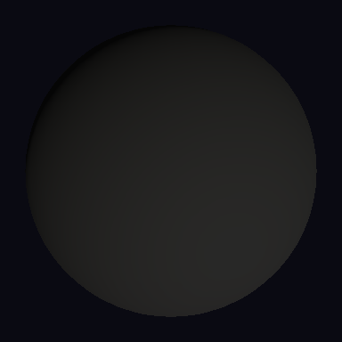 |
| Rough Iron — metallic 1.0 | Charcoal — albedo near 0.0 |

### Severity Levels

| Icon | Severity  | Meaning                                   |
|------|-----------|-------------------------------------------|
| `E`  | `error`   | Definitely incorrect; will produce wrong   |
|      |           | results or compiler errors                 |
| `W`  | `warning` | Likely unintended; may cause visual        |
|      |           | artifacts or performance issues             |
| `I`  | `info`    | Style suggestion or minor improvement      |

### Issue Categories

| Category       | What It Checks                                     |
|----------------|----------------------------------------------------|
| `correctness`  | Syntax errors, type mismatches, undefined variables |
| `physics`      | Non-physical parameter values                      |
| `energy`       | Energy conservation violations                     |
| `performance`  | Expensive operations, unguarded layers             |
| `style`        | Naming conventions, code organisation              |

---

## 9. Synthetic Dataset Generation

The dataset module (`luxc.ai.dataset`) generates large volumes of
physically-plausible Lux shader variants for training and evaluation. Two
generation strategies are available:

### Parametric Expansion

Takes a named material from the PBR database and sweeps roughness levels,
albedo brightness variations, and optional layer combinations to produce a
grid of variants.

```python
from luxc.ai.dataset import expand_material_variants

variants = expand_material_variants(
    base_material="Copper",
    roughness_steps=5,        # 5 roughness levels: 0.0, 0.25, 0.5, 0.75, 1.0
    albedo_variations=3,      # 3 brightness scales: 0.7x, 1.0x, 1.3x
    layer_combinations=["coat"],  # also generate +coat variants
)

# Result: 5 * 3 * 2 = 30 ShaderVariant objects
```

Each `ShaderVariant` contains:
- `name`: e.g. `"Copper_R2_A1"`
- `description`: e.g. `"Copper roughness=0.50 brightness=1.00"`
- `lux_source`: complete, compilable surface declaration
- `parameters`: dict of ground-truth values (for training)

### Constrained Random Generation

Produces random but physically-constrained materials with controlled
distributions:

```python
from luxc.ai.dataset import generate_random_materials

materials = generate_random_materials(count=100, seed=42)
```

Distribution rules:
- 30% metals, 70% dielectrics
- Metal albedo in [0.4, 1.0] range (physically correct for metals)
- Dielectric albedo in [0.02, 0.95] range
- 15% of dielectrics are transmissive (IOR 1.3-2.5)
- 20% of all materials have a coat layer

### Example Generated Source

```lux
surface Copper_R2_A1 {
    properties MatParams {
        base_color: vec3 = vec3(0.930, 0.620, 0.520),
        roughness: scalar = 0.500,
    },
    layers [
        base(
            albedo: MatParams.base_color,
            roughness: MatParams.roughness,
            metallic: 1.0
        ),
    ]
}
```

### Dataset Size Estimates

| Strategy               | Base Materials | Variants per Material | Total   |
|------------------------|---------------:|-----------------------:|--------:|
| Full PBR sweep (5x3)   | 58             | 15                    | 870     |
| Full PBR + coat (5x3x2)| 58             | 30                    | 1,740   |
| Random (default)        | --             | --                    | 100     |
| Random (large)          | --             | --                    | 10,000  |

---

## 10. BRDF Parameter Estimation Dataset

A specialised application of the dataset pipeline for inverse-rendering
research. Each generated variant includes ground-truth PBR parameters as
structured metadata, making it suitable for training neural networks that
estimate material properties from rendered images.

### Data Format

Each `ShaderVariant` carries a `parameters` dict:

```python
{
    "roughness": 0.5,
    "metallic": 1.0,
    "albedo_r": 0.93,
    "albedo_g": 0.62,
    "albedo_b": 0.52,
    "coat_factor": 0.8,       # only if coated
    "coat_roughness": 0.05,   # only if coated
    "ior": 1.52,              # only if transmissive
}
```

### Workflow

```
┌──────────────────┐    ┌───────────────────┐    ┌───────────────────┐
│  PBR Material DB │───>│  Parametric       │───>│  ShaderVariant[]  │
│  (58 materials)  │    │  expansion        │    │  with ground-     │
└──────────────────┘    │  + random gen     │    │  truth params     │
                        └───────────────────┘    └─────────┬─────────┘
                                                           │
                                    ┌──────────────────────┼───────────┐
                                    v                      v           v
                           ┌────────────────┐   ┌──────────────┐  ┌──────┐
                           │  Compile each  │   │  Render on   │  │ JSON │
                           │  .lux file     │   │  sphere/cube │  │ meta │
                           └────────────────┘   └──────────────┘  └──────┘
                                                       │
                                                       v
                                              ┌──────────────────┐
                                              │  (image, params) │
                                              │  training pairs  │
                                              └──────────────────┘
```

---

## 11. Evaluation Benchmark

A standardised suite of 20 test cases that measure AI generation quality across
material categories: basic metals, basic dielectrics, transmissive materials,
layered materials, emissive surfaces, and organic materials.

### Benchmark Cases (data/benchmark_cases.json)

Test cases specify expected parameter ranges and required layers:

```json
{
    "id": "metal-gold",
    "description": "Create a polished gold metal material",
    "category": "basic-metal",
    "expected_properties": {
        "metallic": 1.0,
        "roughness": [0.0, 0.15],
        "albedo_r": [0.85, 1.0],
        "albedo_g": [0.65, 0.85],
        "albedo_b": [0.2, 0.5]
    },
    "required_layers": ["base"]
}
```

### Scoring Criteria

Each test case is scored on four axes:

| Criterion            | How It Is Measured                                    |
|----------------------|-------------------------------------------------------|
| Compilation          | Does the generated code pass parse + type-check?      |
| Parameter Accuracy   | Are extracted values within expected ranges? (0-100%) |
| Energy Conservation  | Albedo <= 1.0, dielectric albedo <= 0.95              |
| Layer Correctness    | Are all required layers present?                      |

### Example Benchmark Output

```
$ python -m luxc.ai.benchmark --provider anthropic --model claude-sonnet-4-20250514

  Running 20 benchmark cases...

  ┌─────────────────────┬──────────┬──────────┬────────┬────────┬──────────┐
  │ Case ID             │ Compiled │ Accuracy │ Energy │ Layers │ Attempts │
  ├─────────────────────┼──────────┼──────────┼────────┼────────┼──────────┤
  │ metal-gold          │    ok    │  100.0%  │   ok   │   ok   │    1     │
  │ metal-copper        │    ok    │   80.0%  │   ok   │   ok   │    1     │
  │ metal-silver        │    ok    │  100.0%  │   ok   │   ok   │    1     │
  │ metal-iron-rough    │    ok    │  100.0%  │   ok   │   ok   │    1     │
  │ dielectric-plastic  │    ok    │  100.0%  │   ok   │   ok   │    1     │
  │ dielectric-wood     │    ok    │  100.0%  │   ok   │   ok   │    2     │
  │ dielectric-concrete │    ok    │  100.0%  │   ok   │   ok   │    1     │
  │ dielectric-ceramic  │    ok    │   80.0%  │   ok   │   ok   │    1     │
  │ glass-clear         │    ok    │  100.0%  │   ok   │   ok   │    1     │
  │ glass-frosted       │    ok    │  100.0%  │   ok   │   ok   │    1     │
  │ water               │    ok    │  100.0%  │   ok   │   ok   │    1     │
  │ car-paint           │    ok    │  100.0%  │   ok   │   ok   │    1     │
  │ coated-metal        │    ok    │  100.0%  │   ok   │   ok   │    2     │
  │ velvet-fabric       │    ok    │  100.0%  │   ok   │   ok   │    1     │
  │ silk-fabric         │    ok    │   80.0%  │   ok   │   ok   │    1     │
  │ emissive-neon       │    ok    │  100.0%  │   ok   │   ok   │    1     │
  │ emissive-lava       │    ok    │  100.0%  │   ok   │   ok   │    1     │
  │ diamond             │    ok    │  100.0%  │   ok   │   ok   │    1     │
  │ skin-medium         │    ok    │  100.0%  │   ok   │   ok   │    1     │
  │ marble-polished     │    ok    │   80.0%  │   ok   │   ok   │    1     │
  └─────────────────────┴──────────┴──────────┴────────┴────────┴──────────┘

  ┌──────────────────────────────────────────────┐
  │  Summary                                     │
  ├──────────────────────────────────────────────┤
  │  Total cases:              20                │
  │  Compilation rate:         100.0%  (20/20)   │
  │  Avg parameter accuracy:   96.0%             │
  │  Energy conservation rate: 100.0%  (20/20)   │
  │  Layer correctness rate:   100.0%  (20/20)   │
  └──────────────────────────────────────────────┘
```

### Benchmark Categories

| Category          | Cases | What It Tests                            |
|-------------------|------:|------------------------------------------|
| `basic-metal`     | 4     | Gold, copper, silver, iron               |
| `basic-dielectric`| 4     | Plastic, wood, concrete, ceramic         |
| `transmissive`    | 4     | Clear glass, frosted glass, water,       |
|                   |       | diamond                                  |
| `layered`         | 4     | Car paint, coated metal, velvet, silk    |
| `emissive`        | 2     | Neon sign, lava                          |
| `organic`         | 2     | Human skin, polished marble              |

---

## 12. Multi-Provider Backend

The AI system supports five provider backends through a unified interface.
All providers implement the same `AIProvider` abstract class with methods for
text completion, multimodal completion (vision), connection testing, and
model listing.

### Supported Providers

| Provider      | Module                          | Vision | Local |
|---------------|---------------------------------|--------|-------|
| Anthropic     | `luxc.ai.providers.anthropic`   | Yes    | No    |
| OpenAI        | `luxc.ai.providers.openai_compat` | Yes  | No    |
| Google Gemini | `luxc.ai.providers.gemini`      | Yes    | No    |
| Ollama        | `luxc.ai.providers.openai_compat` | Varies | Yes  |
| LM Studio     | `luxc.ai.providers.openai_compat` | Varies | Yes  |

### Default Models

| Provider  | Default Model              |
|-----------|----------------------------|
| Anthropic | `claude-sonnet-4-20250514` |
| OpenAI    | `gpt-4o`                   |
| Gemini    | `gemini-2.0-flash`         |
| Ollama    | `llama3.2`                 |
| LM Studio | `default`                  |

### Configuration File

Stored at `~/.luxc/config.toml`:

```toml
[ai]
provider = "anthropic"
model = "claude-sonnet-4-20250514"
api_key = "sk-ant-..."
base_url = ""
max_tokens = 4096
```

### CLI Overrides

Any configuration value can be overridden per-invocation:

```bash
# Use OpenAI instead of the configured provider
luxc --ai "gold metal" --ai-provider openai --ai-model gpt-4o

# Use a local Ollama server
luxc --ai "wood floor" --ai-provider ollama --ai-base-url http://localhost:11434/v1

# Use LM Studio
luxc --ai "stone wall" --ai-provider lm-studio --ai-model my-local-model
```

### Provider Architecture

```
                            ┌─────────────────────┐
                            │  AIProvider (ABC)    │
                            │                     │
                            │  complete()         │
                            │  complete_multimodal│
                            │  supports_vision    │
                            │  test_connection()  │
                            │  list_models()      │
                            └──────────┬──────────┘
                                       │
                 ┌─────────────────────┼─────────────────────┐
                 │                     │                     │
    ┌────────────┴──────────┐  ┌──────┴───────────┐  ┌──────┴────────────┐
    │  AnthropicProvider    │  │  OpenAICompat     │  │  GeminiProvider   │
    │  (anthropic SDK)      │  │  Provider         │  │  (google SDK)     │
    │                       │  │  (openai SDK)     │  │                   │
    │  Claude Sonnet 4,     │  │                   │  │  Gemini 2.0 Flash,│
    │  Claude Opus 4, etc.  │  │  GPT-4o, GPT-4,  │  │  Gemini Pro, etc. │
    └───────────────────────┘  │  Ollama, LM Studio│  └───────────────────┘
                               └───────────────────┘
```

---

## 13. PBR Material Database

Lux ships with a database of 58 physically-measured materials sourced from
[physicallybased.info](https://physicallybased.info/) (CC0 license) and
supplemented with Unreal Engine reference values. All albedo values are in
**linear sRGB** colour space.

The database is embedded in the AI system prompt for every generation request,
giving the model accurate reference values to ground its parameter choices.

### Material Categories

#### Metals (17 materials, metallic = 1.0)

| Material         | Albedo (linear RGB)    | Roughness |
|------------------|------------------------|-----------|
| Aluminum         | (0.91, 0.92, 0.92)    | 0.0       |
| Brass            | (0.91, 0.78, 0.42)    | 0.0       |
| Chromium         | (0.65, 0.69, 0.70)    | 0.0       |
| Cobalt           | (0.70, 0.70, 0.67)    | 0.0       |
| Copper           | (0.93, 0.62, 0.52)    | 0.0       |
| Gold             | (1.00, 0.77, 0.34)    | 0.0       |
| Iron             | (0.53, 0.51, 0.49)    | 0.0       |
| Lead             | (0.63, 0.64, 0.69)    | 0.0       |
| Mercury          | (0.78, 0.78, 0.78)    | 0.0       |
| Nickel           | (0.70, 0.64, 0.56)    | 0.0       |
| Palladium        | (0.73, 0.70, 0.66)    | 0.0       |
| Platinum         | (0.77, 0.73, 0.68)    | 0.0       |
| Silver           | (0.99, 0.99, 0.97)    | 0.0       |
| Stainless Steel  | (0.67, 0.64, 0.60)    | 0.0       |
| Titanium         | (0.44, 0.40, 0.36)    | 0.0       |
| Tungsten         | (0.54, 0.54, 0.52)    | 0.0       |
| Zinc             | (0.81, 0.84, 0.87)    | 0.0       |

> Note: Metal roughness values of 0.0 represent the polished/ideal baseline.
> Adjust upward for brushed (0.3), worn (0.5), or matte (0.9) finishes.

#### Crystals and Gems (9 materials)

| Material  | Albedo (linear RGB)    | Roughness | IOR  |
|-----------|------------------------|-----------|------|
| Diamond   | (1.00, 1.00, 1.00)    | 0.0       | 2.42 |
| Glass     | (1.00, 1.00, 1.00)    | 0.0       | 1.52 |
| Ice       | (1.00, 1.00, 1.00)    | 0.5       | 1.31 |
| Marble    | (0.83, 0.79, 0.75)    | 0.0       | 1.50 |
| Quartz    | (1.00, 1.00, 1.00)    | 0.0       | 1.54 |
| Salt      | (1.00, 1.00, 1.00)    | 0.2       | 1.54 |
| Sand      | (0.44, 0.39, 0.23)    | 0.9       | --   |
| Sapphire  | (0.67, 0.76, 0.86)    | 0.0       | 1.77 |
| Snow      | (0.85, 0.85, 0.85)    | 0.5       | 1.31 |

#### Liquids (5 materials)

| Material | Albedo (linear RGB)    | Roughness | IOR  |
|----------|------------------------|-----------|------|
| Water    | (1.00, 1.00, 1.00)    | 0.0       | 1.33 |
| Blood    | (0.64, 0.003, 0.005)  | 0.0       | 1.35 |
| Coffee   | (0.45, 0.13, 0.03)    | 0.0       | 1.34 |
| Honey    | (0.83, 0.57, 0.04)    | 0.0       | 1.50 |
| Milk     | (0.82, 0.81, 0.68)    | 0.0       | 1.35 |

#### Plastics (2 materials)

| Material         | Albedo (linear RGB)    | Roughness | IOR  |
|------------------|------------------------|-----------|------|
| Plastic (Acrylic)| (1.00, 1.00, 1.00)    | 0.0       | 1.49 |
| Plastic (PVC)    | (1.00, 1.00, 1.00)    | 0.0       | 1.54 |

#### Organic (5 materials)

| Material  | Albedo (linear RGB)    | Roughness |
|-----------|------------------------|-----------|
| Bone      | (0.79, 0.79, 0.66)    | 0.9       |
| Charcoal  | (0.02, 0.02, 0.02)    | 0.9       |
| Chocolate | (0.16, 0.09, 0.06)    | 0.5       |
| Egg Shell | (0.61, 0.62, 0.63)    | 0.9       |
| Pearl     | (0.80, 0.75, 0.70)    | 0.35      |

#### Human / Skin (3 materials)

| Material      | Albedo (linear RGB)    | Roughness | IOR  |
|---------------|------------------------|-----------|------|
| Skin (Light)  | (0.85, 0.64, 0.55)    | 0.5       | 1.40 |
| Skin (Medium) | (0.62, 0.43, 0.34)    | 0.5       | 1.40 |
| Skin (Dark)   | (0.28, 0.15, 0.08)    | 0.5       | 1.40 |

#### Man-made / Architectural (9 materials)

| Material       | Albedo (linear RGB)    | Roughness |
|----------------|------------------------|-----------|
| Blackboard     | (0.04, 0.04, 0.04)    | 0.9       |
| Brick          | (0.26, 0.10, 0.06)    | 0.9       |
| Car Paint      | (0.10, 0.10, 0.10)    | 0.0       |
| Concrete       | (0.51, 0.51, 0.51)    | 0.5       |
| Gray Card (18%)| (0.18, 0.18, 0.18)    | 0.9       |
| Office Paper   | (0.79, 0.83, 0.88)    | 0.8       |
| Porcelain      | (0.75, 0.75, 0.72)    | 0.0       |
| Tire           | (0.02, 0.02, 0.02)    | 0.7       |
| Whiteboard     | (0.87, 0.87, 0.77)    | 0.0       |

#### Ground / Environment (8 materials)

| Material        | Albedo (linear RGB)    | Roughness |
|-----------------|------------------------|-----------|
| Fresh Asphalt   | (0.02, 0.02, 0.02)    | 0.9       |
| Worn Asphalt    | (0.08, 0.08, 0.08)    | 0.85      |
| Bare Soil       | (0.13, 0.13, 0.13)    | 0.9       |
| Green Grass     | (0.21, 0.21, 0.21)    | 0.8       |
| Desert Sand     | (0.36, 0.36, 0.36)    | 0.9       |
| Fresh Concrete  | (0.51, 0.51, 0.51)    | 0.5       |
| Ocean Ice       | (0.56, 0.56, 0.56)    | 0.3       |
| Fresh Snow      | (0.81, 0.81, 0.81)    | 0.5       |

### Roughness Guide

| Label    | Value |
|----------|-------|
| Mirror   | 0.0   |
| Polished | 0.1   |
| Brushed  | 0.3   |
| Rough    | 0.6   |
| Matte    | 0.9   |

---

## 14. Setup Wizard (`--ai-setup`)

An interactive terminal wizard that walks you through selecting a provider,
entering credentials, choosing a model, and verifying the connection. The
wizard auto-detects locally running Ollama and LM Studio instances.

### Usage

```bash
luxc --ai-setup
```

### Example Session

```
$ luxc --ai-setup

  === Lux AI Provider Setup ===

  Available providers:
    1. Anthropic (Claude)
    2. OpenAI (GPT)
    3. Google Gemini
    4. Ollama (detected running locally)
    5. LM Studio

  Select provider [1]: 1

  Selected: anthropic
  API key for anthropic (or Enter to use env var): sk-ant-api03-...

  Available models (showing up to 20):
    1. claude-sonnet-4-20250514 *
    2. claude-opus-4-20250514
    3. claude-haiku-3-20240307

  Select model number or type name [claude-sonnet-4-20250514]: 1

  Testing connection to anthropic with model 'claude-sonnet-4-20250514'...
  Connection successful!

  Config saved to ~/.luxc/config.toml
    provider: anthropic
    model: claude-sonnet-4-20250514

  Done! You can now use 'luxc --ai "description"' with your configured provider.
```

### Local Provider Setup (Ollama)

```
$ luxc --ai-setup

  === Lux AI Provider Setup ===

  Available providers:
    1. Anthropic (Claude)
    2. OpenAI (GPT)
    3. Google Gemini
    4. Ollama (detected running locally)
    5. LM Studio

  Select provider [1]: 4

  Selected: ollama
  Ollama URL [http://localhost:11434/v1]:

  Available models (showing up to 20):
    1. llama3.2 *
    2. codellama
    3. mistral
    4. llava

  Select model number or type name [llama3.2]: 4

  Testing connection to ollama with model 'llava'...
  Connection successful!

  Config saved to ~/.luxc/config.toml
    provider: ollama
    model: llava
    base_url: http://localhost:11434/v1

  Done! You can now use 'luxc --ai "description"' with your configured provider.
```

### Environment Variables

If you prefer not to store the API key in the config file, leave it blank
during setup and export the appropriate environment variable:

| Provider  | Environment Variable     |
|-----------|--------------------------|
| Anthropic | `ANTHROPIC_API_KEY`      |
| OpenAI    | `OPENAI_API_KEY`         |
| Gemini    | `GOOGLE_API_KEY`         |
| Ollama    | (none required)          |
| LM Studio | (none required)          |

---

## 15. Quick Reference

### All AI CLI Flags

| Flag                       | Arguments          | Description                                      |
|----------------------------|--------------------|--------------------------------------------------|
| `--ai`                     | `"description"`    | Generate shader from text description            |
| `--ai-from-image`          | `path`             | Generate material from photograph                |
| `--ai-modify`              | `"instruction"`    | Modify existing material (requires input file)   |
| `--ai-batch`               | `"scene desc"`     | Generate batch of scene materials                |
| `--ai-batch-count`         | `N`                | Override material count for batch                |
| `--ai-from-video`          | `path`             | Generate animated shader from video              |
| `--ai-match-reference`     | `path`             | Iteratively match a reference image              |
| `--ai-match-iterations`    | `N`                | Max refinement iterations (default: 5)           |
| `--ai-critique`            | `path`             | AI code review of a .lux file                    |
| `--ai-skills`              | `skill1,skill2`    | Load specific AI skills                          |
| `--ai-list-skills`         | (none)             | List available skills and exit                   |
| `--ai-setup`               | (none)             | Run interactive provider setup wizard            |
| `--ai-provider`            | `name`             | Override provider for this invocation            |
| `--ai-model`               | `name`             | Override model for this invocation               |
| `--ai-base-url`            | `url`              | Override provider base URL                       |
| `--ai-retries`             | `N`                | Max retry attempts on compile failure (default: 2)|
| `--ai-no-verify`           | (none)             | Skip compilation verification                    |

### Common Workflows

```bash
# Quick material generation
luxc --ai "polished copper"

# Generate from photo with specific output
luxc --ai-from-image brick_wall.jpg -o materials/ brick.lux

# Modify and iterate
luxc --ai-modify "add wear and scratches" metal.lux
luxc --ai-critique metal.lux

# Batch for a scene
luxc --ai-batch "underwater coral reef" --ai-batch-count 6 -o reef/

# Reference matching with high iteration count
luxc --ai-match-reference target.png --ai-match-iterations 10

# Use skills for specialised generation
luxc --ai "VR-optimized stone wall" --ai-skills optimization,pbr-authoring

# Generate with local model
luxc --ai "glass bottle" --ai-provider ollama --ai-model llava
```

### Feature Matrix

| Feature              | Text | Vision | Multimodal | Skills | Verify |
|----------------------|------|--------|------------|--------|--------|
| `--ai`               | Yes  | --     | --         | Yes    | Yes    |
| `--ai-from-image`    | Opt  | Yes    | Yes        | --     | Yes    |
| `--ai-modify`        | Yes  | --     | --         | Auto   | Yes    |
| `--ai-batch`         | Yes  | --     | --         | --     | Yes    |
| `--ai-from-video`    | Opt  | Yes    | Yes        | Auto   | Yes    |
| `--ai-match-reference`| Opt | Yes    | Yes        | --     | Yes    |
| `--ai-critique`      | Yes  | --     | --         | Auto   | --     |

**Legend**: Yes = required, Opt = optional supplementary input, Auto = skills
loaded automatically, -- = not applicable.

---

*This document covers luxc version 0.1.0. For the Lux language specification,
see `SPECIFICATION.md`. For the development roadmap, see `PLAN.md`.*
