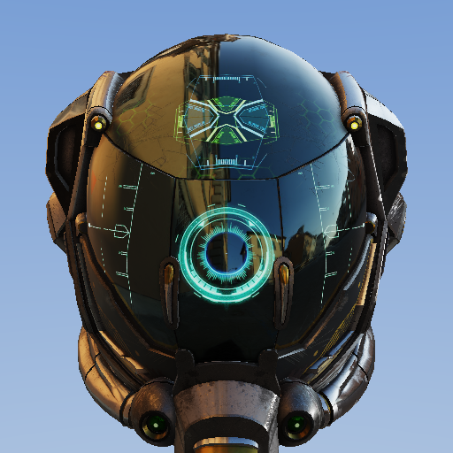
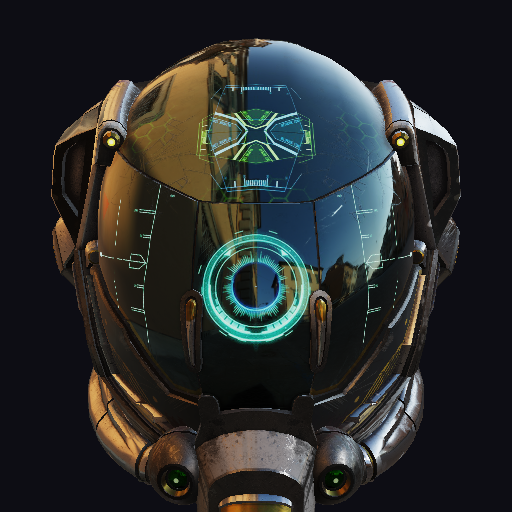
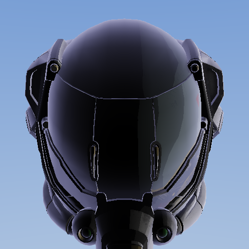
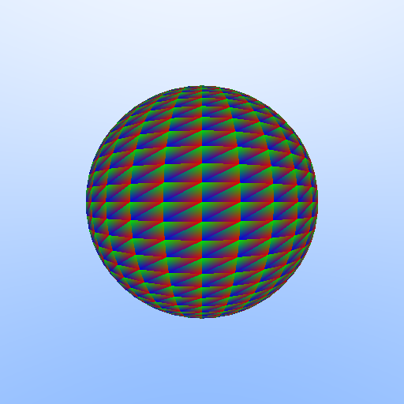

# Lux — Math-First Shader Language

Lux is a shader language designed for humans and LLMs alike. Write rendering math directly — surfaces, materials, lighting — and the compiler handles GPU translation to SPIR-V for Vulkan.

No `layout(set=0, binding=1)`. No `gl_Position`. No boilerplate. Just math.

```
import brdf;

surface CopperMetal {
    brdf: pbr(vec3(0.95, 0.64, 0.54), 0.3, 0.9),
}

geometry StandardMesh {
    position: vec3, normal: vec3, uv: vec2,
    transform: MVP { model: mat4, view: mat4, projection: mat4, }
    outputs {
        world_pos: (model * vec4(position, 1.0)).xyz,
        world_normal: normalize((model * vec4(normal, 0.0)).xyz),
        clip_pos: projection * view * model * vec4(position, 1.0),
    }
}

pipeline PBRForward {
    geometry: StandardMesh,
    surface: CopperMetal,
}
```

The compiler expands this into fully typed vertex + fragment SPIR-V — no manual stage wiring needed.

## Gallery

### glTF PBR with IBL — Ray Traced

Full glTF 2.0 PBR rendering with ray tracing — tangent-space normal mapping, metallic-roughness workflow, IBL with pre-filtered specular cubemap, compile-time feature permutations, and a single `surface` declaration that compiles to both raster and RT pipelines.

<p align="center"></p>

```lux
import brdf;
import color;
import ibl;
import texture;

features {
    has_normal_map: bool,
    has_emission: bool,
}

surface GltfPBR {
    sampler2d base_color_tex,
    sampler2d normal_tex if has_normal_map,
    sampler2d metallic_roughness_tex,
    sampler2d occlusion_tex,
    sampler2d emissive_tex if has_emission,
    samplerCube env_specular,
    samplerCube env_irradiance,
    sampler2d brdf_lut,

    layers [
        base(albedo: srgb_to_linear(sample(base_color_tex, uv).xyz),
             roughness: sample(metallic_roughness_tex, uv).y,
             metallic: sample(metallic_roughness_tex, uv).z),
        normal_map(map: sample(normal_tex, uv).xyz) if has_normal_map,
        ibl(specular_map: env_specular, irradiance_map: env_irradiance,
            brdf_lut: brdf_lut),
        emission(color: srgb_to_linear(sample(emissive_tex, uv).xyz)) if has_emission,
    ]
}

pipeline GltfRT {
    mode: raytrace,
    surface: GltfPBR,
    environment: HDRSky,
    schedule: HighQuality,
}
```

### Mesh Shaders — Meshlet-Based GPU-Driven Rendering

Meshlet-based geometry processing via `VK_EXT_mesh_shader` — the same `surface` declaration compiles to raster, ray tracing, *and* mesh shader pipelines. Engine queries hardware limits, builds meshlets, and compiles with matching `--define` parameters. C++ and Rust engines only.

<p align="center"></p>

```lux
pipeline GltfMesh {
    mode: mesh_shader,
    geometry: StandardMesh,
    surface: GltfPBR,
    schedule: HighQuality,
}
```

```bash
luxc gltf_pbr_layered.lux --pipeline GltfMesh --features has_emission \
    --define max_vertices=64 --define max_primitives=124 --define workgroup_size=32
```

### Cartoon / Toon Shader — Custom `@layer`

User-defined layers via `@layer` annotation — cel-shading with quantized NdotL and rim lighting, applied to glTF PBR models. One `@layer fn cartoon(...)` plugs into the standard layer compositing pipeline.

<p align="center"></p>

```lux
import toon;

surface ToonSurface {
    sampler2d albedo_tex,
    layers [
        base(albedo: sample(albedo_tex, uv).xyz, roughness: 0.8, metallic: 0.0),
        cartoon(bands: 4.0, rim_power: 3.0, rim_color: vec3(0.3, 0.3, 0.5)),
    ]
}
```

### Ray Tracing

Real-time ray traced sphere with barycentric shading and sky gradient — compiled from a single `.lux` file to three SPIR-V stages (raygen, closest-hit, miss).

<p align="center"></p>

```
raygen {
    acceleration_structure tlas;
    ray_payload payload: vec4;
    storage_image output_image;

    fn main() {
        let pixel: uvec3 = launch_id;
        let origin: vec3 = vec3(0.0, 0.0, 2.0);
        let direction: vec3 = normalize(vec3(px * 2.0 - 1.0, py * 2.0 - 1.0, -1.0));
        trace_ray(tlas, 0, 255, 0, 0, 0, origin, 0.001, direction, 1000.0, 0);
        image_store(output_image, vec2(pixel.x, pixel.y), payload);
    }
}
```

### PBR Surface

Declarative material pipeline — just declare geometry, surface BRDF, and pipeline. The compiler generates vertex + fragment stages automatically.

<p align="center"></p>

```
import brdf;

surface TexturedPBR {
    sampler2d albedo_tex,
    brdf: pbr(sample(albedo_tex, frag_uv).xyz, 0.5, 0.0),
}

pipeline PBRForward {
    geometry: StandardMesh,
    surface: TexturedPBR,
}
```

### SDF Shapes

Signed distance field primitives with smooth boolean operations — sphere, box, and torus combined with smooth union.

<p align="center"></p>

```
import sdf;

let d_sphere: scalar = sdf_sphere(p, 0.8);
let d_box: scalar = sdf_box(sdf_translate(p, vec3(1.2, 0.0, 0.0)), vec3(0.5));
let d_torus: scalar = sdf_torus(sdf_translate(p, vec3(-1.2, 0.0, 0.0)), 0.5, 0.2);
let d_final: scalar = sdf_smooth_union(sdf_smooth_union(d_sphere, d_box, 0.3), d_torus, 0.3);
```

### Procedural Noise

Domain-warped FBM noise with Voronoi cell overlay — organic, natural-looking textures from pure math.

<p align="center"></p>

```
import noise;

let n1: scalar = fbm2d_4(p, 2.0, 0.5);
let n2: scalar = fbm2d_4(p + vec2(5.2, 1.3), 2.0, 0.5);
let warped: scalar = fbm2d_4(p + vec2(n1, n2) * 2.0, 2.0, 0.5);
let vor: vec2 = voronoi2d(uv * 6.0);
```

### Automatic Differentiation

Mark any function with `@differentiable` and the compiler generates its derivative. Top: wave function, bottom: auto-generated gradient.

<p align="center"></p>

```
@differentiable
fn wave(x: scalar) -> scalar {
    return sin(x * 6.28318) * 0.5 + x * x * 0.3;
}

let f_val: scalar = wave(x);
let f_grad: scalar = wave_d_x(x);  // auto-generated derivative
```

### Colorspace Transforms

HSV rainbow with artistic controls — contrast, saturation, hue shift, and gamma correction from the colorspace stdlib.

<p align="center"></p>

```
import colorspace;

let rainbow: vec3 = hsv_to_rgb(vec3(hue, sat, val));
let adjusted: vec3 = hue_shift(saturate_color(rainbow, 1.5), 0.15);
let corrected: vec3 = gamma_correct(rainbow, 2.2);
```

### Hello Triangle

The simplest Lux program — per-vertex colors, zero boilerplate. The entire shader is 15 lines.

<p align="center"></p>

```
vertex {
    in position: vec3;
    in color: vec3;
    out frag_color: vec3;

    fn main() {
        frag_color = color;
        builtin_position = vec4(position, 1.0);
    }
}
```

### BRDF & Layer Visualization

GPU-rendered visualization of BRDF functions — Fresnel curves, NDF distributions, polar lobe plots, parameter sweeps, energy conservation furnace tests, and per-layer energy breakdowns. All visualizations are self-contained `.lux` fragment shaders rendered as fullscreen quads.

```bash
# Compile and render all 5 visualization shaders
python -m tools.visualize_brdf --composite

# Render individual panels
python -m tools.visualize_brdf --shader transfer
python -m tools.visualize_brdf --shader polar
python -m tools.visualize_brdf --shader sweep
python -m tools.visualize_brdf --shader furnace
python -m tools.visualize_brdf --shader layers
```

| Shader | Content |
|--------|---------|
| `viz_transfer_functions.lux` | 2x3 grid: Fresnel, GGX NDF, Smith G, Charlie NDF, Lambert vs Burley, conductor Fresnel |
| `viz_brdf_polar.lux` | 2x2 polar lobe plots: GGX specular, Lambert diffuse, sheen, PBR composite |
| `viz_param_sweep.lux` | Viridis heatmaps: roughness x metallic, roughness x NdotV |
| `viz_furnace_test.lux` | White furnace test: hemisphere integration with 16 unrolled samples |
| `viz_layer_energy.lux` | Stacked area chart: per-layer energy (diffuse, specular, coat, sheen) vs viewing angle |

### Native GPU Playgrounds

Three rendering backends — Python/wgpu, C++/Vulkan, Rust/ash — all driven by the same reflection JSON from the Lux compiler:

```bash
# Python (wgpu)
python -m playground.engine --scene sphere --pipeline shadercache/pbr_surface

# C++
cd playground_cpp && cmake -B build && cmake --build build --config Release
./build/Release/lux-playground --pipeline shadercache/gltf_pbr --scene path/to/model.glb

# Rust
cd playground_rust && cargo build --release
./target/release/lux-playground --pipeline shadercache/gltf_pbr --scene path/to/model.glb

# Ray tracing (C++ and Rust)
./build/Release/lux-playground --mode rt shadercache/rt_manual
```

All three engines support reflection-driven descriptor binding, glTF loading, cubemap textures, and IBL.

## Features

- **Declarative materials** — `surface`, `geometry`, `pipeline` blocks expand to full shader stages
- **Layered surfaces** — `layers [base, normal_map, ibl, emission]` with automatic energy conservation, compiles to both raster and RT from one declaration
- **Custom `@layer` functions** — user-defined layers via `@layer fn name(base, n, v, l, ...custom_params) -> vec3`, validated at compile time and composited in declaration order
- **Compile-time features** — `features { has_normal_map: bool }` with `if` guards on any declaration; `--features` and `--all-permutations` for shader permutation generation
- **Material property pipeline** — `properties` block in surface declarations abstracts runtime material data; compiler generates std140 UBO + reflection JSON with defaults; qualified `Material.field` access in layer expressions; all engines wire glTF material properties automatically
- **Algorithm/schedule separation** — swap BRDF variants and tonemapping without touching material code
- **Math-first syntax** — `scalar` not `float`, `builtin_position` not `gl_Position`
- **Auto-layout** — locations, descriptor sets, and bindings assigned by declaration order
- **Standard library** — 80+ functions across 8 modules: BRDF, SDF, noise, color, colorspace, texture, IBL, lighting
- **Automatic differentiation** — `@differentiable` generates gradient functions via forward-mode autodiff
- **Ray tracing** — `mode: raytrace` pipelines, `environment`/`procedural` declarations, RT stage blocks
- **Mesh shaders** — `mode: mesh_shader` pipelines, `task`/`mesh` stages, meshlet-based geometry, `--define` compile-time parameters (C++ and Rust only)
- **GLSL transpiler** — `--transpile` converts GLSL fragment shaders to Lux
- **AI generation** — `--ai "description"` generates shaders from natural language
- **One file, multi-stage** — vertex, fragment, and RT stages in a single `.lux` file
- **Full SPIR-V output** — compiles to validated `.spv` binaries via `spirv-as` + `spirv-val`
- **40+ built-in functions** — math, vector, matrix, texture sampling (2D + cubemap + explicit LOD), RT instructions
- **glTF 2.0 PBR** — tangent normal mapping, metallic-roughness, image-based lighting, multi-scattering
- **Rendering engine** — unified scene/pipeline architecture with Python, C++, and Rust Vulkan backends
- **IBL pipeline** — offline HDR preprocessing to specular cubemap + irradiance + BRDF LUT
- **Swizzle & constructors** — `v.xyz`, `vec4(pos, 1.0)`, `vec3(0.5)` (splat)
- **Import system** — `import brdf;` pulls in stdlib or local modules
- **User-defined functions** with inlining, structs, type aliases, constants
- **BRDF visualization** — GPU-rendered transfer function graphs, polar lobe plots, parameter sweep heatmaps, white furnace tests, and per-layer energy breakdowns

## Prerequisites

- **Python 3.11+**
- **SPIR-V Tools** (`spirv-as`, `spirv-val`) — from the [Vulkan SDK](https://vulkan.lunarg.com/sdk/home) or [spirv-tools](https://github.com/KhronosGroup/SPIRV-Tools)

## Installation

```bash
git clone https://github.com/rudybear/lux.git
cd lux
pip install -e ".[dev]"
```

Verify:

```bash
python -m luxc --version
# luxc 0.1.0
```

## Usage

### Compile a shader

```bash
python -m luxc examples/hello_triangle.lux
# Wrote examples/hello_triangle.vert.spv
# Wrote examples/hello_triangle.frag.spv
```

### Compile a declarative surface pipeline

```bash
python -m luxc examples/pbr_surface.lux
# Wrote examples/pbr_surface.vert.spv
# Wrote examples/pbr_surface.frag.spv
```

### Compile a ray tracing pipeline

```bash
python -m luxc examples/rt_pathtracer.lux
# Wrote examples/rt_pathtracer.rgen.spv
# Wrote examples/rt_pathtracer.rchit.spv
# Wrote examples/rt_pathtracer.rmiss.spv
```

### Compile a mesh shader pipeline

```bash
python -m luxc examples/gltf_pbr_layered.lux --pipeline GltfMesh --features has_emission --define max_vertices=64 --define max_primitives=124 --define workgroup_size=32
# Wrote shadercache/gltf_pbr_layered+emission.mesh.spv
# Wrote shadercache/gltf_pbr_layered+emission.frag.spv
```

### Compile a specific pipeline

```bash
python -m luxc examples/gltf_pbr_layered.lux --pipeline GltfForward
# Wrote examples/gltf_pbr_layered.vert.spv
# Wrote examples/gltf_pbr_layered.frag.spv

python -m luxc examples/gltf_pbr_layered.lux --pipeline GltfRT
# Wrote examples/gltf_pbr_layered.rgen.spv
# Wrote examples/gltf_pbr_layered.rchit.spv
# Wrote examples/gltf_pbr_layered.rmiss.spv
```

### Compile with features

```bash
# List available features
python -m luxc examples/gltf_pbr_layered.lux --list-features
# Available features:
#   has_normal_map
#   has_clearcoat
#   has_sheen
#   has_emission

# Compile with specific features enabled
python -m luxc examples/gltf_pbr_layered.lux --pipeline GltfForward \
    --features has_normal_map,has_emission
# Wrote gltf_pbr_layered+emission+normal_map.vert.spv
# Wrote gltf_pbr_layered+emission+normal_map.frag.spv

# Compile base variant (no features)
python -m luxc examples/gltf_pbr_layered.lux --pipeline GltfForward
# Wrote gltf_pbr_layered.vert.spv
# Wrote gltf_pbr_layered.frag.spv

# Compile all 2^N permutations
python -m luxc examples/gltf_pbr_layered.lux --pipeline GltfForward \
    --all-permutations
# Compiling 16 permutations...
# Wrote gltf_pbr_layered.manifest.json
```

### Transpile GLSL to Lux

```bash
python -m luxc shader.glsl --transpile
# Transpiled: shader.lux
```

### Generate a shader with AI

```bash
python -m luxc --ai "frosted glass with subsurface scattering" -o generated.lux
# Generated: generated.lux
```

### Options

```
python -m luxc input.lux [options]

Options:
  --emit-asm          Write .spvasm text files alongside .spv
  --dump-ast          Dump the AST as JSON and exit
  --no-validate       Skip spirv-val validation
  -o OUTPUT_DIR       Output directory (default: same as input)
  --pipeline NAME     Compile only the named pipeline
  --features FEAT,...   Enable compile-time features (comma-separated)
  --all-permutations    Compile all 2^N feature permutations
  --list-features       List available features and exit
  --define KEY=VALUE  Set compile-time parameter (e.g., --define max_vertices=64)
  --no-reflection     Skip .lux.json reflection metadata
  -g, --debug         Emit OpLine/OpSource debug info
  --transpile         Transpile GLSL input to Lux
  --ai DESCRIPTION    Generate shader from natural language
  --ai-model MODEL    Model for AI generation (default: claude-sonnet-4-20250514)
  --ai-no-verify      Skip compilation verification of AI output
  --version           Show version
```

## Language Reference

### Types

| Lux Type | SPIR-V | Notes |
|----------|--------|-------|
| `scalar` | `OpTypeFloat 32` | Always f32 |
| `int` / `uint` | `OpTypeInt 32` | Signed / unsigned |
| `bool` | `OpTypeBool` | |
| `vec2` / `vec3` / `vec4` | `OpTypeVector` | Float vectors |
| `ivec2/3/4` / `uvec2/3/4` | `OpTypeVector` | Integer vectors |
| `mat2` / `mat3` / `mat4` | `OpTypeMatrix` | Column-major |
| `sampler2d` | `OpTypeSampledImage` | Combined image sampler |
| `samplerCube` | `OpTypeSampledImage (Cube)` | Cubemap image sampler |
| `acceleration_structure` | `OpTypeAccelerationStructureKHR` | RT top-level acceleration structure |

### Stage Blocks

```
vertex {
    in position: vec3;          // auto location=0
    in normal: vec3;            // auto location=1
    out frag_normal: vec3;      // auto location=0

    uniform MVP {               // auto set=0, binding=0
        model: mat4,
        view: mat4,
        projection: mat4,
    }

    push Camera { view_pos: vec3 }

    fn main() {
        builtin_position = projection * view * model * vec4(position, 1.0);
    }
}

fragment {
    in frag_normal: vec3;
    out color: vec4;

    sampler2d albedo_tex;       // auto set=0, binding=0

    fn main() {
        color = vec4(normalize(frag_normal), 1.0);
    }
}
```

### Declarative Materials

Lux v0.2 introduces high-level material declarations that expand to shader stages:

```
import brdf;

// Geometry: vertex layout + transform + outputs
geometry StandardMesh {
    position: vec3, normal: vec3, uv: vec2,
    transform: MVP { model: mat4, view: mat4, projection: mat4, }
    outputs {
        world_pos: (model * vec4(position, 1.0)).xyz,
        world_normal: normalize((model * vec4(normal, 0.0)).xyz),
        frag_uv: uv,
        clip_pos: projection * view * model * vec4(position, 1.0),
    }
}

// Surface: material properties + BRDF
surface TexturedPBR {
    sampler2d albedo_tex,
    brdf: pbr(sample(albedo_tex, frag_uv).xyz, 0.5, 0.0),
}

// Pipeline: wires geometry to surface, compiler generates stages
pipeline PBRForward {
    geometry: StandardMesh,
    surface: TexturedPBR,
}
```

### Layered Surfaces

For complex PBR pipelines, use `layers [...]` instead of `brdf:` — one surface generates both forward and RT shaders:

```
import brdf;
import color;
import ibl;

surface GltfPBR {
    sampler2d base_color_tex,
    samplerCube env_specular,
    samplerCube env_irradiance,
    sampler2d brdf_lut,

    layers [
        base(albedo: srgb_to_linear(sample(base_color_tex, uv).xyz),
             roughness: sample(mr_tex, uv).y, metallic: sample(mr_tex, uv).z),
        normal_map(map: sample(normal_tex, uv).xyz),
        ibl(specular_map: env_specular, irradiance_map: env_irradiance,
            brdf_lut: brdf_lut),
        emission(color: srgb_to_linear(sample(emissive_tex, uv).xyz)),
    ]
}

pipeline GltfForward {
    geometry: StandardMesh,
    surface: GltfPBR,
    schedule: HighQuality,
}

pipeline GltfRT {
    mode: raytrace,
    surface: GltfPBR,
    environment: HDRSky,
    schedule: HighQuality,
}
```

Layers are listed bottom-to-top (base first, outermost last). The compiler generates energy-conserving evaluation with `sample()` auto-rewritten to `sample_lod()` for RT.

#### Custom Layers with `@layer`

Define custom layers as annotated functions. The first 4 parameters (base color, normal, view, light) are provided automatically; remaining parameters come from layer arguments:

```
import toon;

@layer
fn cartoon(base: vec3, n: vec3, v: vec3, l: vec3,
           bands: scalar, rim_power: scalar, rim_color: vec3) -> vec3 {
    let n_dot_l: scalar = max(dot(n, l), 0.0);
    let quantized: scalar = floor(n_dot_l * bands + 0.5) / bands;
    let cel: vec3 = base * quantized;
    let n_dot_v: scalar = max(dot(n, v), 0.0);
    let rim: scalar = pow(1.0 - n_dot_v, rim_power);
    return cel + rim_color * rim;
}

surface ToonSurface {
    sampler2d albedo_tex,
    layers [
        base(albedo: sample(albedo_tex, uv).xyz, roughness: 0.8, metallic: 0.0),
        cartoon(bands: 4.0, rim_power: 3.0, rim_color: vec3(0.3, 0.3, 0.5)),
    ]
}
```

Custom layers are validated at compile time (signature, return type, no name collision with built-in layers) and inserted in declaration order after built-in layers, before emission.

Built-in layer types:

| Layer | Purpose | Parameters |
|-------|---------|------------|
| `base` | PBR direct lighting | albedo, roughness, metallic |
| `normal_map` | TBN normal perturbation | map |
| `ibl` | Image-based lighting | specular_map, irradiance_map, brdf_lut |
| `emission` | Additive emission | color |
| `coat` | Clearcoat | factor, roughness |
| `sheen` | Sheen/fuzz | color, roughness |
| *custom* | User-defined `@layer` function | function-specific |

### Compile-Time Features

Declare boolean feature flags and use `if` guards to conditionally include declarations:

```
features {
    has_normal_map: bool,
    has_clearcoat: bool,
}

geometry StandardMesh {
    position: vec3,
    normal: vec3,
    tangent: vec4 if has_normal_map,
    // ...
}

surface GltfPBR {
    sampler2d normal_tex if has_normal_map,
    sampler2d clearcoat_tex if has_clearcoat,

    layers [
        base(albedo: ..., roughness: ..., metallic: ...),
        normal_map(map: sample(normal_tex, uv).xyz) if has_normal_map,
    ]
}
```

Guards work on any comma-separated declaration item: surface samplers, layers, geometry fields, output bindings, schedule members, and pipeline members.

Module-level `if` blocks group multiple declarations:

```
if has_clearcoat {
    import clearcoat;
}
```

Feature expressions support `&&`, `||`, `!`, and parentheses:

```
sheen(color: ...) if (has_sheen && !has_clearcoat),
```

Features are resolved at compile time — disabled items are stripped before expansion. The generated SPIR-V contains no dead code.

### Material Property Pipeline

The `properties` block declares an abstract data source for runtime material parameters inside a `surface` declaration. Instead of hardcoding BRDF inputs, you declare typed fields with defaults -- the compiler generates a UBO (std140 layout) and reflection JSON so engines can fill in values at runtime from glTF materials or any other source.

```
import brdf;
import color;

surface GltfPBR {
    sampler2d base_color_tex,
    sampler2d metallic_roughness_tex,

    properties Material {
        base_color_factor: vec4 = vec4(1.0, 1.0, 1.0, 1.0),
        emissive_factor: vec3 = vec3(0.0),
        metallic_factor: scalar = 1.0,
        roughness_factor: scalar = 1.0,
        emissive_strength: scalar = 1.0,
        ior: scalar = 1.5,
        clearcoat_factor: scalar = 0.0,
        clearcoat_roughness_factor: scalar = 0.0,
        sheen_roughness_factor: scalar = 0.0,
        transmission_factor: scalar = 0.0,
        sheen_color_factor: vec3 = vec3(0.0),
    },

    layers [
        base(albedo: srgb_to_linear(sample(base_color_tex, uv).xyz)
                     * Material.base_color_factor.xyz,
             roughness: sample(metallic_roughness_tex, uv).y
                        * Material.roughness_factor,
             metallic: sample(metallic_roughness_tex, uv).z
                        * Material.metallic_factor),
    ]
}
```

Fields are accessed with qualified syntax (`Material.roughness_factor`) and can appear anywhere in layer expressions -- multiplied with texture samples, used directly, or composed with other fields. Swizzling works as expected (`Material.base_color_factor.xyz`).

The compiler generates:

- A **UBO** with std140 layout placed in the fragment shader (and closest-hit / mesh stages for RT and mesh pipelines)
- **Reflection JSON** (`*.lux.json`) that lists each field's name, type, byte offset, and default value -- engines read this to build the buffer without hardcoding struct layouts

All three engines (Python/wgpu, C++/Vulkan, Rust/ash) use the reflection JSON to wire glTF material properties into the generated UBO automatically. When loading a glTF model, each engine reads the material's `pbrMetallicRoughness`, clearcoat, sheen, transmission, and emissive parameters and fills the corresponding UBO fields. Fields not present in the glTF material fall back to the defaults declared in the `properties` block.

### Algorithm/Schedule Separation

Decouple *what* to render from *how* to render it:

```
surface CopperMetal {
    brdf: pbr(vec3(0.95, 0.64, 0.54), 0.3, 0.9),
}

schedule HighQuality {
    fresnel: schlick,
    distribution: ggx,
    geometry_term: smith_ggx,
    tonemap: aces,
}

schedule Mobile {
    distribution: ggx_fast,
    geometry_term: smith_ggx_fast,
    tonemap: reinhard,
}

pipeline DesktopForward {
    geometry: StandardMesh,
    surface: CopperMetal,
    schedule: HighQuality,
}
```

### Ray Tracing

Declarative RT pipelines expand surfaces to raygen + closest_hit + miss stages:

```
import brdf;

surface CopperMetal {
    brdf: pbr(vec3(0.95, 0.64, 0.54), 0.3, 0.9),
}

environment GradientSky {
    color: mix(vec3(1.0), vec3(0.5, 0.7, 1.0), 0.5),
}

pipeline PathTracer {
    mode: raytrace,
    surface: CopperMetal,
    environment: GradientSky,
    max_bounces: 1,
}
```

Or write RT stages manually with full control (see [Ray Tracing Stages](#ray-tracing) below).

### Mesh Shaders

Mesh shaders provide a third rendering pipeline mode alongside rasterization and ray tracing. Instead of the traditional vertex/index pipeline, mesh shaders operate on meshlets -- small clusters of triangles processed by workgroups -- enabling GPU-driven rendering with fine-grained culling.

The surface declaration works unchanged; only the geometry processing stage changes:

```
pipeline GltfMesh {
    mode: mesh_shader,
    geometry: StandardMesh,
    surface: GltfPBR,
    schedule: HighQuality,
}
```

The `GltfMesh` pipeline lives alongside `GltfForward` and `GltfRT` in the same `gltf_pbr_layered.lux` file. Compile with `--define` to set hardware-matched limits:

```bash
luxc gltf_pbr_layered.lux --pipeline GltfMesh --features has_emission --define max_vertices=64 --define max_primitives=124 --define workgroup_size=32
```

The approach is data-driven: at runtime the engine queries hardware capabilities (`maxMeshOutputVertices`, `maxMeshOutputPrimitives`, `maxMeshWorkGroupSize`), builds meshlets that respect those limits, and compiles the shader with matching `--define` parameters. This ensures optimal meshlet sizing across different GPU vendors without source changes.

Mesh shaders require `VK_EXT_mesh_shader` and are supported in the C++ and Rust engines only -- Python/wgpu does not expose mesh shader support.

### Ray Tracing Stages (Manual)

Or write RT stages manually with full control:

```
raygen {
    acceleration_structure tlas;
    ray_payload payload: vec4;

    fn main() {
        let origin: vec3 = vec3(0.0, 0.0, 2.0);
        let direction: vec3 = normalize(vec3(0.0, 0.0, -1.0));
        trace_ray(tlas, 0, 255, 0, 0, 0, origin, 0.001, direction, 1000.0, 0);
    }
}

closest_hit {
    ray_payload payload: vec4;
    hit_attribute attribs: vec2;

    fn main() {
        let shade: scalar = 1.0 / (1.0 + hit_t * hit_t * 0.1);
        payload = vec4(shade, shade, shade, 1.0);
    }
}

miss {
    ray_payload payload: vec4;

    fn main() {
        let t: scalar = world_ray_direction.y * 0.5 + 0.5;
        payload = vec4(mix(vec3(1.0), vec3(0.5, 0.7, 1.0), vec3(t)), 1.0);
    }
}
```

Or write mesh/task stages manually:

```
task {
    task_payload payload: MeshletPayload;

    fn main() {
        // Frustum cull meshlets on the task shader side
        payload.meshlet_id = workgroup_id.x;
        emit_mesh_tasks(1, 1, 1);
    }
}

mesh {
    mesh_output vertices: 64;
    mesh_output primitives: 126;

    fn main() {
        set_mesh_outputs(3, 1);
        // Emit a single triangle from meshlet data
    }
}
```

### Automatic Differentiation

Mark functions with `@differentiable` to auto-generate gradient functions:

```
@differentiable
fn energy(x: scalar) -> scalar {
    return x * x + sin(x);
}

fragment {
    in param: scalar;
    out color: vec4;
    fn main() {
        let val: scalar = energy(param);
        let grad: scalar = energy_d_x(param);  // auto-generated
        color = vec4(val, grad, 0.0, 1.0);
    }
}
```

The compiler generates `energy_d_x` using forward-mode differentiation rules for all supported operations.

### Standard Library

Import modules with `import <name>;` — functions are inlined at the call site.

| Module | Functions | Description |
|--------|-----------|-------------|
| `brdf` | 30+ | Fresnel (Schlick, conductor), NDF (GGX, Charlie, anisotropic), Geometry (Smith GGX, height-correlated), Diffuse (Lambert, Oren-Nayar, Burley), Composite (PBR, glTF PBR), Clearcoat, Sheen, Transmission BTDF, Volumetric refraction (Walter 2007), Iridescence (Belcour 2017), Dispersion (Abbe number), Volume attenuation |
| `ibl` | 8 | Specular/diffuse IBL contributions, Fresnel-roughness, GGX importance sampling, Hammersley sequence, combined glTF PBR+IBL with multi-scattering energy compensation |
| `sdf` | 18 | Sphere, box, round box, plane, torus, cylinder, capsule, union, intersection, subtraction, smooth union/subtraction, translate, scale, repeat, round, onion, elongate |
| `noise` | 13 | Hash functions (2D/3D), value noise, gradient/Perlin noise, FBM (4/6 octaves, 2D/3D, loop-unrolled), Voronoi 2D |
| `color` | 5 | linear-to-sRGB, sRGB-to-linear, luminance, Reinhard tonemap, ACES tonemap |
| `colorspace` | 8 | RGB-to-HSV, HSV-to-RGB, contrast, saturation, hue shift, brightness, gamma correction |
| `texture` | 11 | TBN normal perturbation, normal unpacking, triplanar projection (weights, UVs, blending), parallax offset, UV rotation, UV tiling |
| `toon` | 1 | Cartoon cel-shading with quantized NdotL + rim lighting (`@layer` function) |
| `compositing` | 2 | IBL multi-scattering (Fdez-Aguera 2019), layer compositing helpers |

### Built-in Functions

**GLSL.std.450**: `normalize`, `reflect`, `refract`, `pow`, `sin`, `cos`, `tan`, `asin`, `acos`, `atan`, `atan2` (2-arg atan), `exp`, `exp2`, `log`, `log2`, `sqrt`, `inversesqrt`, `abs`, `sign`, `floor`, `ceil`, `fract`, `min`, `max`, `clamp`, `mix`, `step`, `smoothstep`, `length`, `distance`, `cross`, `fma`, `mod`

**Native SPIR-V**: `dot` (OpDot)

**Texture**: `sample(tex, uv)` (OpImageSampleImplicitLod), `sample_lod(tex, uv, lod)` (OpImageSampleExplicitLod — explicit mip level for IBL pre-filtered environment maps)

**Ray tracing**: `trace_ray`, `report_intersection`, `execute_callable`, `ignore_intersection`, `terminate_ray`

### User-Defined Functions

```
fn fresnel_schlick(cos_theta: scalar, f0: vec3) -> vec3 {
    return f0 + (vec3(1.0) - f0) * pow(1.0 - cos_theta, 5.0);
}
```

Module-level functions can be called from any stage block. They are inlined at the call site.

### Constants

```
const PI: scalar = 3.14159265;
```

### Imports

```
import brdf;        // loads luxc/stdlib/brdf.lux
import noise;       // loads luxc/stdlib/noise.lux
```

The compiler searches `luxc/stdlib/` first, then the source file's directory.

## Compiler Pipeline

```
input.lux
  -> Lark Parser         (lux.lark grammar)
  -> Tree Builder         (Transformer -> AST dataclasses)
  -> Feature Stripping    (compile-time conditional removal)
  -> Import Resolver      (stdlib + local .lux modules)
  -> Surface Expander     (surface/geometry/pipeline -> stage blocks)
  -> Autodiff Expander    (@differentiable -> gradient functions)
  -> Type Checker         (resolve types, check operators, validate)
  -> Constant Folder      (compile-time evaluation)
  -> Layout Assigner      (auto-assign location/set/binding)
  -> SPIR-V Builder       (emit .spvasm text per stage)
  -> spirv-as             (assemble to .spv binary)
  -> spirv-val            (validate)
  -> output: name.{vert,frag,rgen,rchit,rmiss,mesh,task,...}.spv
```

## Project Structure

```
luxc/
    __init__.py
    __main__.py              # python -m luxc
    cli.py                   # argparse CLI
    compiler.py              # pipeline orchestration
    ai/
        generate.py          # AI shader generation
        system_prompt.py     # LLM system prompt
    analysis/
        symbols.py           # symbol table, scopes
        type_checker.py      # type checking + overload resolution
        layout_assigner.py   # auto-assign locations/bindings/sets
    autodiff/
        forward_diff.py      # forward-mode autodiff expansion
    builtins/
        types.py             # built-in type definitions
        functions.py         # built-in function signatures (40+)
    codegen/
        spirv_builder.py     # SPIR-V assembly text generator
        spirv_types.py       # type registry + deduplication
        glsl_ext.py          # GLSL.std.450 instruction mappings
        spv_assembler.py     # spirv-as / spirv-val invocation
    expansion/
        surface_expander.py  # surface/geometry/pipeline expansion
    features/
        __init__.py
        evaluator.py             # compile-time feature stripping
    grammar/
        lux.lark             # Lux EBNF grammar
        glsl_subset.lark     # GLSL transpiler grammar
    optimization/
        const_fold.py        # constant folding
    parser/
        ast_nodes.py         # AST dataclasses
        tree_builder.py      # Lark Transformer -> AST
    stdlib/
        brdf.lux             # 30+ BRDF functions
        sdf.lux              # 18 SDF primitives + CSG
        noise.lux            # 13 noise + FBM + Voronoi
        color.lux            # tonemapping + color space
        colorspace.lux       # HSV, contrast, saturation
        texture.lux          # normal maps, triplanar, UV utils
        ibl.lux              # image-based lighting + multi-scattering
        lighting.lux         # multi-light shading (directional, point, spot)
        toon.lux             # @layer cartoon cel-shading + rim lighting
        compositing.lux      # IBL multi-scattering, layer compositing helpers
    transpiler/
        glsl_ast.py          # GLSL AST nodes
        glsl_parser.py       # GLSL subset parser
        glsl_to_lux.py       # GLSL -> Lux transpiler
examples/
    hello_triangle.lux       # simplest working program
    pbr_basic.lux            # manual PBR with uniforms + textures
    pbr_surface.lux          # declarative surface/geometry/pipeline
    scheduled_pbr.lux        # algorithm/schedule separation
    sdf_shapes.lux           # SDF stdlib demo
    procedural_noise.lux     # noise stdlib demo
    differentiable.lux       # @differentiable autodiff
    rt_pathtracer.lux        # declarative RT pipeline
    rt_manual.lux            # hand-written RT stages
    brdf_gallery.lux         # BRDF comparison (Lambert, GGX, PBR, clearcoat)
    colorspace_demo.lux      # HSV rainbow + colorspace transforms
    texture_demo.lux         # UV tiling, rotation, triplanar weights
    autodiff_demo.lux        # wave function + auto-generated derivative
    advanced_materials_demo.lux  # transmission, iridescence, dispersion, volume
    gltf_pbr.lux             # glTF 2.0 PBR with IBL + normal mapping
    gltf_pbr_rt.lux          # ray traced glTF PBR
    gltf_pbr_layered.lux     # layered surface — unified raster + RT pipeline
    cartoon_toon.lux         # @layer custom functions — cel-shading + rim lighting
    lighting_demo.lux        # multi-light PBR (directional, point, spot)
    ibl_demo.lux             # image-based lighting demo
    math_builtins_demo.lux   # built-in function visualizer
    viz_transfer_functions.lux  # BRDF transfer function graphs (2x3 grid)
    viz_brdf_polar.lux       # polar lobe visualization (2x2 grid)
    viz_param_sweep.lux      # parameter sweep heatmaps (viridis)
    viz_furnace_test.lux     # white furnace test (energy conservation)
    viz_layer_energy.lux     # per-layer energy breakdown (stacked area)
playground/
    engine.py                # unified rendering engine (scene/pipeline separation)
    reflected_pipeline.py    # reflection-driven descriptor binding
    gltf_loader.py           # glTF 2.0 scene loader (meshes, materials, textures)
    scene_utils.py           # procedural scene generators
    preprocess_ibl.py        # HDR/EXR -> cubemap + irradiance + BRDF LUT
    test_*.py                # screenshot tests (15 tests)
assets/                      # glTF models, IBL maps (downloaded separately, gitignored)
playground_cpp/
    src/                     # native Vulkan C++ renderer (raster + RT + mesh, GLFW)
playground_rust/
    src/                     # native Vulkan Rust renderer (ash, winit, raster + RT + mesh)
run_interactive_cpp.bat      # launch interactive C++ raster viewer
run_interactive_rust.bat     # launch interactive Rust raster viewer
run_interactive_cpp_rt.bat   # launch interactive C++ RT viewer
run_interactive_rust_rt.bat  # launch interactive Rust RT viewer
run_interactive_cartoon_*.bat  # cartoon shader viewers (raster + RT, C++ + Rust)
compile_mesh.bat             # compile mesh shader pipeline
run_mesh_headless_*.bat      # headless mesh shader rendering (C++ + Rust)
run_mesh_interactive_*.bat   # interactive mesh shader viewers (C++ + Rust)
compile_gltf_*.bat           # compile + render glTF pipelines (forward, RT, layered)
screenshots/                 # rendered gallery screenshots
shadercache/                 # compiled SPV + reflection JSON (generated, gitignored)
tests/
    test_parser.py
    test_type_checker.py
    test_codegen.py
    test_e2e.py
    test_autodiff.py
    test_transpiler.py
    test_ai_generate.py
    test_training_data.py
    test_p5_builtins.py
    test_p5_3_advanced.py
    test_p6_raytracing.py
    test_custom_layers.py
    test_gltf_extensions.py
    test_mesh_shader.py         # P13 mesh shader tests (compilation, expansion, reflection)
    test_brdf_visualization.py  # P15 BRDF visualization tests (10 tests)
tools/
    generate_training_data.py
    visualize_brdf.py        # BRDF visualization CLI (compile + render + composite)
```

## Examples

| Example | Features |
|---------|----------|
| `hello_triangle.lux` | Vertex + fragment, per-vertex color |
| `pbr_basic.lux` | Blinn-Phong, Fresnel, uniforms, push constants, textures |
| `pbr_surface.lux` | Declarative `geometry` + `surface` + `pipeline` |
| `scheduled_pbr.lux` | Algorithm/schedule separation, ACES tonemap |
| `sdf_shapes.lux` | SDF stdlib: sphere, box, torus, smooth union |
| `procedural_noise.lux` | Noise stdlib: FBM domain warping + Voronoi |
| `differentiable.lux` | `@differentiable` + auto-generated gradient |
| `rt_pathtracer.lux` | Declarative RT: surface + environment + `mode: raytrace` |
| `rt_manual.lux` | Hand-written raygen + closest_hit + miss |
| `brdf_gallery.lux` | Lambert, GGX microfacet, PBR metallic, clearcoat |
| `colorspace_demo.lux` | HSV conversion, contrast, saturation, gamma |
| `texture_demo.lux` | UV tiling, rotation, triplanar weight visualization |
| `autodiff_demo.lux` | Wave function + derivative visualization |
| `advanced_materials_demo.lux` | Transmission, iridescence, dispersion, volume attenuation |
| `gltf_pbr.lux` | glTF 2.0 PBR: tangent normal mapping, metallic-roughness, IBL cubemaps, multi-scattering |
| `gltf_pbr_rt.lux` | Ray traced glTF PBR: same material model with RT stages |
| `gltf_pbr_layered.lux` | Layered surface: unified raster + RT + mesh shader from one surface declaration |
| `cartoon_toon.lux` | Custom `@layer` function: cel-shading + rim lighting (raster + RT) |
| `lighting_demo.lux` | Multi-light: directional, point, spot lights with PBR |
| `ibl_demo.lux` | Image-based lighting showcase: specular + diffuse IBL |
| `math_builtins_demo.lux` | Built-in function visualizer: sin, smoothstep, fract, etc. |
| `viz_transfer_functions.lux` | BRDF transfer function graphs: Fresnel, NDF, geometry, diffuse curves |
| `viz_brdf_polar.lux` | Polar lobe visualization: GGX, Lambert, sheen, PBR composite |
| `viz_param_sweep.lux` | Parameter sweep heatmaps: roughness x metallic, roughness x NdotV |
| `viz_furnace_test.lux` | White furnace test: energy conservation with hemisphere integration |
| `viz_layer_energy.lux` | Per-layer energy breakdown: stacked area chart of BRDF contributions |

## Screenshot Tests

The `playground/` directory contains screenshot tests that compile, render, and validate each example:

```bash
# Run individual tests
python playground/test_hello_triangle.py
python playground/test_pbr_surface.py
python playground/test_brdf_gallery.py
python playground/test_colorspace.py
python playground/test_texture_utils.py
python playground/test_autodiff.py
python playground/test_advanced_materials.py
python playground/test_rt_pathtracer.py
python playground/test_gltf_pbr.py
python playground/test_lighting.py
python playground/test_ibl.py
python playground/test_math_builtins.py
```

Each test compiles the shader, renders to a 512x512 PNG, and validates pixel-level properties (coverage, color distribution, spatial variation).

### Rendering Engines

Three rendering backends share the same compiled shaders and reflection JSON:

**Python (wgpu) — headless only:**
```bash
python -m playground.engine --scene assets/DamagedHelmet.glb --pipeline shadercache/gltf_pbr --output render.png
python -m playground.engine --scene sphere --pipeline shadercache/pbr_surface --output sphere.png
python -m playground.engine --scene assets/DamagedHelmet.glb --pipeline shadercache/gltf_pbr --ibl pisa --output render_ibl.png
```

**C++ (Vulkan/GLFW) — headless and interactive:**
```bash
# Headless render to PNG
playground_cpp/build/Release/lux-playground.exe --scene assets/DamagedHelmet.glb --pipeline shadercache/gltf_pbr_rt --ibl pisa --output render.png

# Interactive viewer (orbit camera: drag to rotate, scroll to zoom, ESC to exit)
playground_cpp/build/Release/lux-playground.exe --scene assets/DamagedHelmet.glb --pipeline shadercache/gltf_pbr_rt --ibl pisa --interactive
```

**Rust (ash/winit) — headless and interactive:**
```bash
# Headless render to PNG
playground_rust/target/release/lux-playground.exe --scene assets/DamagedHelmet.glb --pipeline shadercache/gltf_pbr_rt --ibl pisa --output render.png

# Interactive viewer (orbit camera: drag to rotate, scroll to zoom, ESC to exit)
playground_rust/target/release/lux-playground.exe --scene assets/DamagedHelmet.glb --pipeline shadercache/gltf_pbr_rt --ibl pisa --interactive
```

**Batch files for quick launch:**
```bash
run_interactive_cpp.bat     # Interactive C++ raster viewer
run_interactive_rust.bat    # Interactive Rust raster viewer
run_interactive_cpp_rt.bat  # Interactive C++ RT viewer
run_interactive_rust_rt.bat # Interactive Rust RT viewer
compile_gltf_rt.bat         # Compile + render glTF RT (headless, both engines)
compile_gltf_forward.bat    # Compile + render glTF raster (all 3 engines)
compile_gltf_all.bat        # Compile + render all pipeline variants
compile_mesh.bat            # Compile mesh shader pipeline
run_mesh_headless_cpp.bat   # Render mesh shaders headless (C++)
run_mesh_headless_rust.bat  # Render mesh shaders headless (Rust)
run_mesh_interactive_cpp.bat  # Interactive mesh shader viewer (C++)
run_mesh_interactive_rust.bat # Interactive mesh shader viewer (Rust)
```

**Common CLI flags** (C++ and Rust engines):
| Flag | Description |
|------|-------------|
| `--scene <PATH>` | Scene source: `.glb`/`.gltf` file, `sphere`, `triangle`, `fullscreen` |
| `--pipeline <BASE>` | Shader base path (auto-resolved from scene if omitted) |
| `--ibl <NAME>` | IBL environment name from `assets/ibl/` (default: auto-detect `pisa`) |
| `--interactive` | Open a window with orbit camera |
| `--width <N>` | Output width (default: 512, interactive: 1024) |
| `--height <N>` | Output height (default: 512, interactive: 768) |
| `--output <PATH>` | Output PNG path for headless mode |

### IBL Preprocessing

Convert HDR environment maps to pre-filtered cubemaps for image-based lighting:

```bash
# Download and preprocess a Khronos sample environment
python -m playground.preprocess_ibl --download neutral

# Process a custom HDR panorama
python -m playground.preprocess_ibl my_environment.hdr
```

Output: specular cubemap (6 faces x 5 mips), irradiance cubemap, and BRDF integration LUT.

## Running Tests

```bash
pip install -e ".[dev]"
python -m pytest tests/ -v
# 425 tests
```

Requires `spirv-as` and `spirv-val` on PATH for end-to-end tests.

## Assets

The `assets/` directory contains glTF 2.0 sample models and HDR environment maps used for rendering tests and demos. These are tracked via Git LFS.

**glTF models** — official [Khronos glTF Sample Assets](https://github.com/KhronosGroup/glTF-Sample-Assets):

| Asset | Source | Purpose |
|-------|--------|---------|
| `DamagedHelmet.glb` | Khronos glTF Sample Assets | Primary PBR test model (normal maps, metallic-roughness, emission) |
| `MetalRoughSpheres.glb` | Khronos glTF Sample Assets | Metallic-roughness parameter sweep grid |
| `MetalRoughSpheresNoTextures.glb` | Khronos glTF Sample Assets | Parameter-only variant (no textures) |
| `ClearCoatTest.glb` | Khronos glTF Sample Assets | `KHR_materials_clearcoat` extension test |
| `SheenChair.glb` | Khronos glTF Sample Assets | `KHR_materials_sheen` extension test |
| `TransmissionTest.glb` | Khronos glTF Sample Assets | `KHR_materials_transmission` extension test |

**HDR environment maps:**

| Asset | Purpose |
|-------|---------|
| `pisa.hdr` | Pisa courtyard IBL environment (diffuse + specular) |
| `neutral.hdr` | Neutral studio IBL environment |

**Preprocessed IBL data** (`assets/ibl/`): pre-filtered specular cubemaps, irradiance cubemaps, and BRDF integration LUTs generated by `python -m playground.preprocess_ibl`.

## Design Decisions

| Decision | Choice | Rationale |
|----------|--------|-----------|
| `scalar` not `float` | Mathematical vocabulary | Reads naturally in equations |
| No layout qualifiers | Auto-assigned by order | Eliminates #1 source of GLSL bugs |
| `builtin_position` | Explicit naming | No magic globals, greppable |
| `:` type annotations | Rust-like syntax | LLMs generate this reliably |
| One file, multi-stage | `vertex {}` / `fragment {}` | Natural unit of compilation |
| Explicit types | No inference | LLMs produce more correct code |
| Declarative surfaces | `surface` + `geometry` + `pipeline` | Separates material math from plumbing |
| Schedule separation | `schedule` blocks | Same material, different quality targets |
| Function inlining | No SPIR-V OpFunctionCall | Simplifies codegen, stdlib works everywhere |
| Forward-mode autodiff | `@differentiable` annotation | Natural for shader parameter gradients |
| No loops | Unrolled FBM/Voronoi | Simpler codegen, deterministic performance |
| Direct AST to SPIR-V | No IR | Simpler, faster path to working output |

## License

MIT
