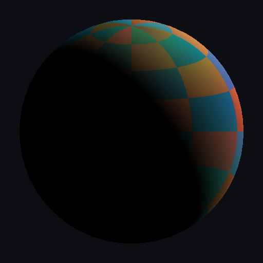
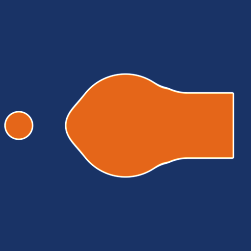
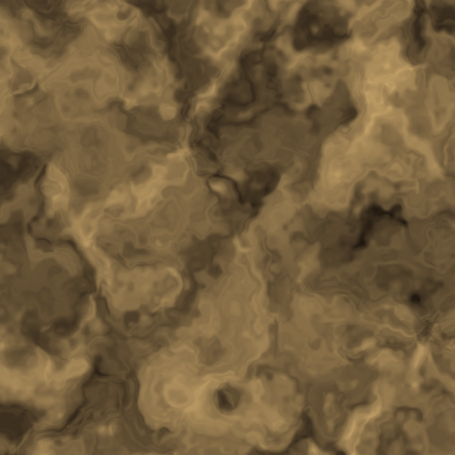
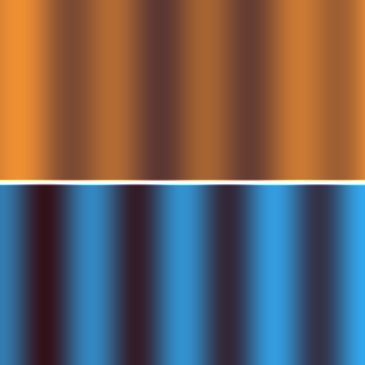
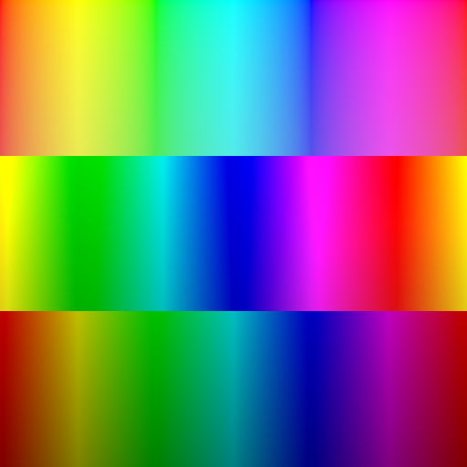
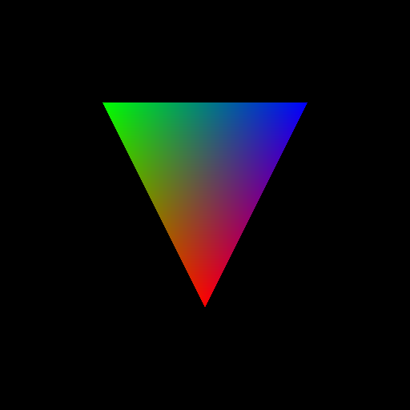

# Lux — Math-First Shader Language

Lux is a shader language designed for humans and LLMs alike. Write rendering math directly — surfaces, materials, lighting — and the compiler handles GPU translation to SPIR-V for Vulkan.

No `layout(set=0, binding=1)`. No `gl_Position`. No boilerplate. Just math.

```
import brdf;

surface CopperMetal {
    brdf: pbr(vec3(0.95, 0.64, 0.54), 0.3, 0.9),
}

geometry StandardMesh {
    position: vec3, normal: vec3, uv: vec2,
    transform: MVP { model: mat4, view: mat4, projection: mat4, }
    outputs {
        world_pos: (model * vec4(position, 1.0)).xyz,
        world_normal: normalize((model * vec4(normal, 0.0)).xyz),
        clip_pos: projection * view * model * vec4(position, 1.0),
    }
}

pipeline PBRForward {
    geometry: StandardMesh,
    surface: CopperMetal,
}
```

The compiler expands this into fully typed vertex + fragment SPIR-V — no manual stage wiring needed.

## Gallery

### Ray Tracing

Real-time ray traced sphere with barycentric shading and sky gradient — compiled from a single `.lux` file to three SPIR-V stages (raygen, closest-hit, miss).

<p align="center"></p>

```
raygen {
    acceleration_structure tlas;
    ray_payload payload: vec4;
    storage_image output_image;

    fn main() {
        let pixel: uvec3 = launch_id;
        let origin: vec3 = vec3(0.0, 0.0, 2.0);
        let direction: vec3 = normalize(vec3(px * 2.0 - 1.0, py * 2.0 - 1.0, -1.0));
        trace_ray(tlas, 0, 255, 0, 0, 0, origin, 0.001, direction, 1000.0, 0);
        image_store(output_image, vec2(pixel.x, pixel.y), payload);
    }
}
```

### PBR Surface

Declarative material pipeline — just declare geometry, surface BRDF, and pipeline. The compiler generates vertex + fragment stages automatically.

<p align="center"></p>

```
import brdf;

surface TexturedPBR {
    sampler2d albedo_tex,
    brdf: pbr(sample(albedo_tex, frag_uv).xyz, 0.5, 0.0),
}

pipeline PBRForward {
    geometry: StandardMesh,
    surface: TexturedPBR,
}
```

### SDF Shapes

Signed distance field primitives with smooth boolean operations — sphere, box, and torus combined with smooth union.

<p align="center"></p>

```
import sdf;

let d_sphere: scalar = sdf_sphere(p, 0.8);
let d_box: scalar = sdf_box(sdf_translate(p, vec3(1.2, 0.0, 0.0)), vec3(0.5));
let d_torus: scalar = sdf_torus(sdf_translate(p, vec3(-1.2, 0.0, 0.0)), 0.5, 0.2);
let d_final: scalar = sdf_smooth_union(sdf_smooth_union(d_sphere, d_box, 0.3), d_torus, 0.3);
```

### Procedural Noise

Domain-warped FBM noise with Voronoi cell overlay — organic, natural-looking textures from pure math.

<p align="center"></p>

```
import noise;

let n1: scalar = fbm2d_4(p, 2.0, 0.5);
let n2: scalar = fbm2d_4(p + vec2(5.2, 1.3), 2.0, 0.5);
let warped: scalar = fbm2d_4(p + vec2(n1, n2) * 2.0, 2.0, 0.5);
let vor: vec2 = voronoi2d(uv * 6.0);
```

### Automatic Differentiation

Mark any function with `@differentiable` and the compiler generates its derivative. Top: wave function, bottom: auto-generated gradient.

<p align="center"></p>

```
@differentiable
fn wave(x: scalar) -> scalar {
    return sin(x * 6.28318) * 0.5 + x * x * 0.3;
}

let f_val: scalar = wave(x);
let f_grad: scalar = wave_d_x(x);  // auto-generated derivative
```

### Colorspace Transforms

HSV rainbow with artistic controls — contrast, saturation, hue shift, and gamma correction from the colorspace stdlib.

<p align="center"></p>

```
import colorspace;

let rainbow: vec3 = hsv_to_rgb(vec3(hue, sat, val));
let adjusted: vec3 = hue_shift(saturate_color(rainbow, 1.5), 0.15);
let corrected: vec3 = gamma_correct(rainbow, 2.2);
```

### Hello Triangle

The simplest Lux program — per-vertex colors, zero boilerplate. The entire shader is 15 lines.

<p align="center"></p>

```
vertex {
    in position: vec3;
    in color: vec3;
    out frag_color: vec3;

    fn main() {
        frag_color = color;
        builtin_position = vec4(position, 1.0);
    }
}
```

### Native GPU Playgrounds

Both C++ and Rust native Vulkan renderers are included — build from source and render any `.lux` shader, including ray tracing:

```bash
# C++
cd playground_cpp && cmake -B build && cmake --build build --config Release
./build/Release/lux-playground --mode rt playground/rt_manual

# Rust
cd playground_rust && cargo build --release
./target/release/lux-playground --mode rt playground/rt_manual
```

## Features

- **Declarative materials** — `surface`, `geometry`, `pipeline` blocks expand to full shader stages
- **Algorithm/schedule separation** — swap BRDF variants and tonemapping without touching material code
- **Math-first syntax** — `scalar` not `float`, `builtin_position` not `gl_Position`
- **Auto-layout** — locations, descriptor sets, and bindings assigned by declaration order
- **Standard library** — 70+ functions across 6 modules: BRDF, SDF, noise, color, colorspace, texture
- **Automatic differentiation** — `@differentiable` generates gradient functions via forward-mode autodiff
- **Ray tracing** — `mode: raytrace` pipelines, `environment`/`procedural` declarations, RT stage blocks
- **GLSL transpiler** — `--transpile` converts GLSL fragment shaders to Lux
- **AI generation** — `--ai "description"` generates shaders from natural language
- **One file, multi-stage** — vertex, fragment, and RT stages in a single `.lux` file
- **Full SPIR-V output** — compiles to validated `.spv` binaries via `spirv-as` + `spirv-val`
- **40+ built-in functions** — math, vector, matrix, texture sampling, RT instructions
- **Swizzle & constructors** — `v.xyz`, `vec4(pos, 1.0)`, `vec3(0.5)` (splat)
- **Import system** — `import brdf;` pulls in stdlib or local modules
- **User-defined functions** with inlining, structs, type aliases, constants

## Prerequisites

- **Python 3.11+**
- **SPIR-V Tools** (`spirv-as`, `spirv-val`) — from the [Vulkan SDK](https://vulkan.lunarg.com/sdk/home) or [spirv-tools](https://github.com/KhronosGroup/SPIRV-Tools)

## Installation

```bash
git clone https://github.com/rudybear/lux.git
cd lux
pip install -e ".[dev]"
```

Verify:

```bash
python -m luxc --version
# luxc 0.1.0
```

## Usage

### Compile a shader

```bash
python -m luxc examples/hello_triangle.lux
# Wrote examples/hello_triangle.vert.spv
# Wrote examples/hello_triangle.frag.spv
```

### Compile a declarative surface pipeline

```bash
python -m luxc examples/pbr_surface.lux
# Wrote examples/pbr_surface.vert.spv
# Wrote examples/pbr_surface.frag.spv
```

### Compile a ray tracing pipeline

```bash
python -m luxc examples/rt_pathtracer.lux
# Wrote examples/rt_pathtracer.rgen.spv
# Wrote examples/rt_pathtracer.rchit.spv
# Wrote examples/rt_pathtracer.rmiss.spv
```

### Transpile GLSL to Lux

```bash
python -m luxc shader.glsl --transpile
# Transpiled: shader.lux
```

### Generate a shader with AI

```bash
python -m luxc --ai "frosted glass with subsurface scattering" -o generated.lux
# Generated: generated.lux
```

### Options

```
python -m luxc input.lux [options]

Options:
  --emit-asm          Write .spvasm text files alongside .spv
  --dump-ast          Dump the AST as JSON and exit
  --no-validate       Skip spirv-val validation
  -o OUTPUT_DIR       Output directory (default: same as input)
  --transpile         Transpile GLSL input to Lux
  --ai DESCRIPTION    Generate shader from natural language
  --ai-model MODEL    Model for AI generation (default: claude-sonnet-4-20250514)
  --ai-no-verify      Skip compilation verification of AI output
  --version           Show version
```

## Language Reference

### Types

| Lux Type | SPIR-V | Notes |
|----------|--------|-------|
| `scalar` | `OpTypeFloat 32` | Always f32 |
| `int` / `uint` | `OpTypeInt 32` | Signed / unsigned |
| `bool` | `OpTypeBool` | |
| `vec2` / `vec3` / `vec4` | `OpTypeVector` | Float vectors |
| `ivec2/3/4` / `uvec2/3/4` | `OpTypeVector` | Integer vectors |
| `mat2` / `mat3` / `mat4` | `OpTypeMatrix` | Column-major |
| `sampler2d` | `OpTypeSampledImage` | Combined image sampler |
| `acceleration_structure` | `OpTypeAccelerationStructureKHR` | RT top-level acceleration structure |

### Stage Blocks

```
vertex {
    in position: vec3;          // auto location=0
    in normal: vec3;            // auto location=1
    out frag_normal: vec3;      // auto location=0

    uniform MVP {               // auto set=0, binding=0
        model: mat4,
        view: mat4,
        projection: mat4,
    }

    push Camera { view_pos: vec3 }

    fn main() {
        builtin_position = projection * view * model * vec4(position, 1.0);
    }
}

fragment {
    in frag_normal: vec3;
    out color: vec4;

    sampler2d albedo_tex;       // auto set=0, binding=0

    fn main() {
        color = vec4(normalize(frag_normal), 1.0);
    }
}
```

### Declarative Materials

Lux v0.2 introduces high-level material declarations that expand to shader stages:

```
import brdf;

// Geometry: vertex layout + transform + outputs
geometry StandardMesh {
    position: vec3, normal: vec3, uv: vec2,
    transform: MVP { model: mat4, view: mat4, projection: mat4, }
    outputs {
        world_pos: (model * vec4(position, 1.0)).xyz,
        world_normal: normalize((model * vec4(normal, 0.0)).xyz),
        frag_uv: uv,
        clip_pos: projection * view * model * vec4(position, 1.0),
    }
}

// Surface: material properties + BRDF
surface TexturedPBR {
    sampler2d albedo_tex,
    brdf: pbr(sample(albedo_tex, frag_uv).xyz, 0.5, 0.0),
}

// Pipeline: wires geometry to surface, compiler generates stages
pipeline PBRForward {
    geometry: StandardMesh,
    surface: TexturedPBR,
}
```

### Algorithm/Schedule Separation

Decouple *what* to render from *how* to render it:

```
surface CopperMetal {
    brdf: pbr(vec3(0.95, 0.64, 0.54), 0.3, 0.9),
}

schedule HighQuality {
    fresnel: schlick,
    distribution: ggx,
    geometry_term: smith_ggx,
    tonemap: aces,
}

schedule Mobile {
    distribution: ggx_fast,
    geometry_term: smith_ggx_fast,
    tonemap: reinhard,
}

pipeline DesktopForward {
    geometry: StandardMesh,
    surface: CopperMetal,
    schedule: HighQuality,
}
```

### Ray Tracing

Declarative RT pipelines expand surfaces to raygen + closest_hit + miss stages:

```
import brdf;

surface CopperMetal {
    brdf: pbr(vec3(0.95, 0.64, 0.54), 0.3, 0.9),
}

environment GradientSky {
    color: mix(vec3(1.0), vec3(0.5, 0.7, 1.0), 0.5),
}

pipeline PathTracer {
    mode: raytrace,
    surface: CopperMetal,
    environment: GradientSky,
    max_bounces: 1,
}
```

Or write RT stages manually with full control:

```
raygen {
    acceleration_structure tlas;
    ray_payload payload: vec4;

    fn main() {
        let origin: vec3 = vec3(0.0, 0.0, 2.0);
        let direction: vec3 = normalize(vec3(0.0, 0.0, -1.0));
        trace_ray(tlas, 0, 255, 0, 0, 0, origin, 0.001, direction, 1000.0, 0);
    }
}

closest_hit {
    ray_payload payload: vec4;
    hit_attribute attribs: vec2;

    fn main() {
        let shade: scalar = 1.0 / (1.0 + hit_t * hit_t * 0.1);
        payload = vec4(shade, shade, shade, 1.0);
    }
}

miss {
    ray_payload payload: vec4;

    fn main() {
        let t: scalar = world_ray_direction.y * 0.5 + 0.5;
        payload = vec4(mix(vec3(1.0), vec3(0.5, 0.7, 1.0), vec3(t)), 1.0);
    }
}
```

### Automatic Differentiation

Mark functions with `@differentiable` to auto-generate gradient functions:

```
@differentiable
fn energy(x: scalar) -> scalar {
    return x * x + sin(x);
}

fragment {
    in param: scalar;
    out color: vec4;
    fn main() {
        let val: scalar = energy(param);
        let grad: scalar = energy_d_x(param);  // auto-generated
        color = vec4(val, grad, 0.0, 1.0);
    }
}
```

The compiler generates `energy_d_x` using forward-mode differentiation rules for all supported operations.

### Standard Library

Import modules with `import <name>;` — functions are inlined at the call site.

| Module | Functions | Description |
|--------|-----------|-------------|
| `brdf` | 30+ | Fresnel (Schlick, conductor), NDF (GGX, Charlie, anisotropic), Geometry (Smith GGX, height-correlated), Diffuse (Lambert, Oren-Nayar, Burley), Composite (PBR, glTF PBR), Clearcoat, Sheen, Transmission BTDF, Volumetric refraction (Walter 2007), Iridescence (Belcour 2017), Dispersion (Abbe number), Volume attenuation |
| `sdf` | 18 | Sphere, box, round box, plane, torus, cylinder, capsule, union, intersection, subtraction, smooth union/subtraction, translate, scale, repeat, round, onion, elongate |
| `noise` | 13 | Hash functions (2D/3D), value noise, gradient/Perlin noise, FBM (4/6 octaves, 2D/3D, loop-unrolled), Voronoi 2D |
| `color` | 5 | linear-to-sRGB, sRGB-to-linear, luminance, Reinhard tonemap, ACES tonemap |
| `colorspace` | 8 | RGB-to-HSV, HSV-to-RGB, contrast, saturation, hue shift, brightness, gamma correction |
| `texture` | 11 | TBN normal perturbation, normal unpacking, triplanar projection (weights, UVs, blending), parallax offset, UV rotation, UV tiling |

### Built-in Functions

**GLSL.std.450**: `normalize`, `reflect`, `refract`, `pow`, `sin`, `cos`, `tan`, `asin`, `acos`, `atan`, `atan2` (2-arg atan), `exp`, `exp2`, `log`, `log2`, `sqrt`, `inversesqrt`, `abs`, `sign`, `floor`, `ceil`, `fract`, `min`, `max`, `clamp`, `mix`, `step`, `smoothstep`, `length`, `distance`, `cross`, `fma`, `mod`

**Native SPIR-V**: `dot` (OpDot)

**Texture**: `sample(tex, uv)` (OpImageSampleImplicitLod)

**Ray tracing**: `trace_ray`, `report_intersection`, `execute_callable`, `ignore_intersection`, `terminate_ray`

### User-Defined Functions

```
fn fresnel_schlick(cos_theta: scalar, f0: vec3) -> vec3 {
    return f0 + (vec3(1.0) - f0) * pow(1.0 - cos_theta, 5.0);
}
```

Module-level functions can be called from any stage block. They are inlined at the call site.

### Constants

```
const PI: scalar = 3.14159265;
```

### Imports

```
import brdf;        // loads luxc/stdlib/brdf.lux
import noise;       // loads luxc/stdlib/noise.lux
```

The compiler searches `luxc/stdlib/` first, then the source file's directory.

## Compiler Pipeline

```
input.lux
  -> Lark Parser         (lux.lark grammar)
  -> Tree Builder         (Transformer -> AST dataclasses)
  -> Import Resolver      (stdlib + local .lux modules)
  -> Surface Expander     (surface/geometry/pipeline -> stage blocks)
  -> Autodiff Expander    (@differentiable -> gradient functions)
  -> Type Checker         (resolve types, check operators, validate)
  -> Constant Folder      (compile-time evaluation)
  -> Layout Assigner      (auto-assign location/set/binding)
  -> SPIR-V Builder       (emit .spvasm text per stage)
  -> spirv-as             (assemble to .spv binary)
  -> spirv-val            (validate)
  -> output: name.{vert,frag,rgen,rchit,rmiss,...}.spv
```

## Project Structure

```
luxc/
    __init__.py
    __main__.py              # python -m luxc
    cli.py                   # argparse CLI
    compiler.py              # pipeline orchestration
    ai/
        generate.py          # AI shader generation
        system_prompt.py     # LLM system prompt
    analysis/
        symbols.py           # symbol table, scopes
        type_checker.py      # type checking + overload resolution
        layout_assigner.py   # auto-assign locations/bindings/sets
    autodiff/
        forward_diff.py      # forward-mode autodiff expansion
    builtins/
        types.py             # built-in type definitions
        functions.py         # built-in function signatures (40+)
    codegen/
        spirv_builder.py     # SPIR-V assembly text generator
        spirv_types.py       # type registry + deduplication
        glsl_ext.py          # GLSL.std.450 instruction mappings
        spv_assembler.py     # spirv-as / spirv-val invocation
    expansion/
        surface_expander.py  # surface/geometry/pipeline expansion
    grammar/
        lux.lark             # Lux EBNF grammar
        glsl_subset.lark     # GLSL transpiler grammar
    optimization/
        const_fold.py        # constant folding
    parser/
        ast_nodes.py         # AST dataclasses
        tree_builder.py      # Lark Transformer -> AST
    stdlib/
        brdf.lux             # 30+ BRDF functions
        sdf.lux              # 18 SDF primitives + CSG
        noise.lux            # 13 noise + FBM + Voronoi
        color.lux            # tonemapping + color space
        colorspace.lux       # HSV, contrast, saturation
        texture.lux          # normal maps, triplanar, UV utils
    transpiler/
        glsl_ast.py          # GLSL AST nodes
        glsl_parser.py       # GLSL subset parser
        glsl_to_lux.py       # GLSL -> Lux transpiler
examples/
    hello_triangle.lux       # simplest working program
    pbr_basic.lux            # manual PBR with uniforms + textures
    pbr_surface.lux          # declarative surface/geometry/pipeline
    scheduled_pbr.lux        # algorithm/schedule separation
    sdf_shapes.lux           # SDF stdlib demo
    procedural_noise.lux     # noise stdlib demo
    differentiable.lux       # @differentiable autodiff
    rt_pathtracer.lux        # declarative RT pipeline
    rt_manual.lux            # hand-written RT stages
    brdf_gallery.lux         # BRDF comparison (Lambert, GGX, PBR, clearcoat)
    colorspace_demo.lux      # HSV rainbow + colorspace transforms
    texture_demo.lux         # UV tiling, rotation, triplanar weights
    autodiff_demo.lux        # wave function + auto-generated derivative
    advanced_materials_demo.lux  # transmission, iridescence, dispersion, volume
playground/
    render_harness.py        # wgpu render (triangle + fullscreen quad)
    render_pbr.py            # PBR sphere renderer
    test_*.py                # screenshot tests (10 tests)
tests/
    test_parser.py
    test_type_checker.py
    test_codegen.py
    test_e2e.py
    test_autodiff.py
    test_transpiler.py
    test_ai_generate.py
    test_training_data.py
    test_p5_builtins.py
    test_p5_3_advanced.py
    test_p6_raytracing.py
tools/
    generate_training_data.py
```

## Examples

| Example | Features |
|---------|----------|
| `hello_triangle.lux` | Vertex + fragment, per-vertex color |
| `pbr_basic.lux` | Blinn-Phong, Fresnel, uniforms, push constants, textures |
| `pbr_surface.lux` | Declarative `geometry` + `surface` + `pipeline` |
| `scheduled_pbr.lux` | Algorithm/schedule separation, ACES tonemap |
| `sdf_shapes.lux` | SDF stdlib: sphere, box, torus, smooth union |
| `procedural_noise.lux` | Noise stdlib: FBM domain warping + Voronoi |
| `differentiable.lux` | `@differentiable` + auto-generated gradient |
| `rt_pathtracer.lux` | Declarative RT: surface + environment + `mode: raytrace` |
| `rt_manual.lux` | Hand-written raygen + closest_hit + miss |
| `brdf_gallery.lux` | Lambert, GGX microfacet, PBR metallic, clearcoat |
| `colorspace_demo.lux` | HSV conversion, contrast, saturation, gamma |
| `texture_demo.lux` | UV tiling, rotation, triplanar weight visualization |
| `autodiff_demo.lux` | Wave function + derivative visualization |
| `advanced_materials_demo.lux` | Transmission, iridescence, dispersion, volume attenuation |

## Screenshot Tests

The `playground/` directory contains screenshot tests that compile, render, and validate each example:

```bash
# Run individual tests
python playground/test_hello_triangle.py
python playground/test_pbr_surface.py
python playground/test_brdf_gallery.py
python playground/test_colorspace.py
python playground/test_texture_utils.py
python playground/test_autodiff.py
python playground/test_advanced_materials.py
python playground/test_rt_pathtracer.py
```

Each test compiles the shader, renders to a 512x512 PNG, and validates pixel-level properties (coverage, color distribution, spatial variation).

## Running Tests

```bash
pip install -e ".[dev]"
python -m pytest tests/ -v
# 260 tests
```

Requires `spirv-as` and `spirv-val` on PATH for end-to-end tests.

## Design Decisions

| Decision | Choice | Rationale |
|----------|--------|-----------|
| `scalar` not `float` | Mathematical vocabulary | Reads naturally in equations |
| No layout qualifiers | Auto-assigned by order | Eliminates #1 source of GLSL bugs |
| `builtin_position` | Explicit naming | No magic globals, greppable |
| `:` type annotations | Rust-like syntax | LLMs generate this reliably |
| One file, multi-stage | `vertex {}` / `fragment {}` | Natural unit of compilation |
| Explicit types | No inference | LLMs produce more correct code |
| Declarative surfaces | `surface` + `geometry` + `pipeline` | Separates material math from plumbing |
| Schedule separation | `schedule` blocks | Same material, different quality targets |
| Function inlining | No SPIR-V OpFunctionCall | Simplifies codegen, stdlib works everywhere |
| Forward-mode autodiff | `@differentiable` annotation | Natural for shader parameter gradients |
| No loops | Unrolled FBM/Voronoi | Simpler codegen, deterministic performance |
| Direct AST to SPIR-V | No IR | Simpler, faster path to working output |

## License

MIT
