# Lux — Math-First Shader Language

Lux is a shader language designed for humans and LLMs alike. Write rendering math directly — surfaces, materials, lighting — and the compiler handles GPU translation to SPIR-V for Vulkan and Metal.

No `layout(set=0, binding=1)`. No `gl_Position`. No boilerplate. Just math.

```
import brdf;

surface CopperMetal {
    brdf: pbr(vec3(0.95, 0.64, 0.54), 0.3, 0.9),
}

geometry StandardMesh {
    position: vec3, normal: vec3, uv: vec2,
    transform: MVP { model: mat4, view: mat4, projection: mat4, }
    outputs {
        world_pos: (model * vec4(position, 1.0)).xyz,
        world_normal: normalize((model * vec4(normal, 0.0)).xyz),
        clip_pos: projection * view * model * vec4(position, 1.0),
    }
}

pipeline PBRForward {
    geometry: StandardMesh,
    surface: CopperMetal,
}
```

The compiler expands this into fully typed vertex + fragment SPIR-V — no manual stage wiring needed.

## Gallery

<p align="center">
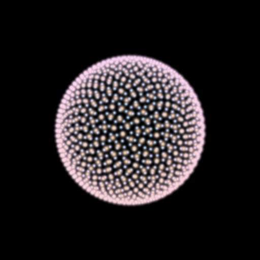
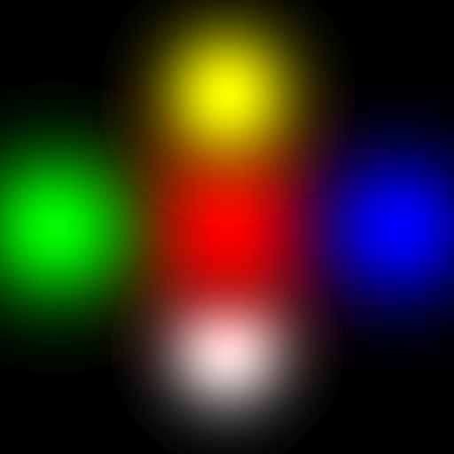

</p>
<p align="center"><em>Left/center: Gaussian splatting — first-class <code>splat</code> declaration, 3-stage pipeline (compute + vertex + fragment), SH color, 2D Gaussian alpha compositing, interactive orbit camera in C++/Rust/Python. Right: glTF PBR ray tracing — one surface declaration generates both raster and RT pipelines.</em></p>

<p align="center">
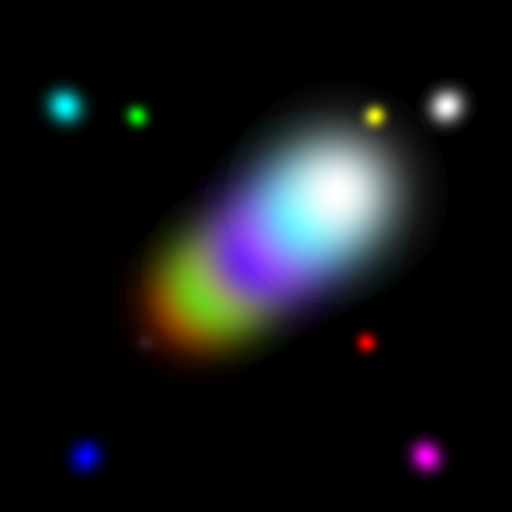
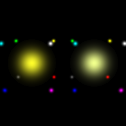
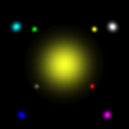
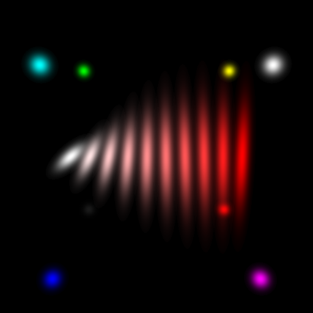
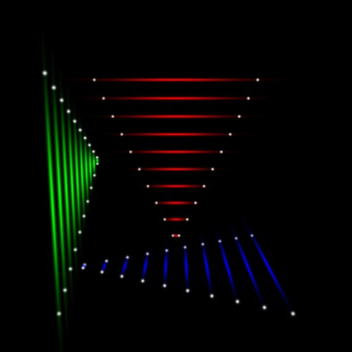
</p>
<p align="center"><em>KHR_gaussian_splatting conformance: all 11 official Khronos test scenes pass — SH degrees 0–3, rotations, scales, depth ordering, hybrid mesh+splat rendering</em></p>

<p align="center">
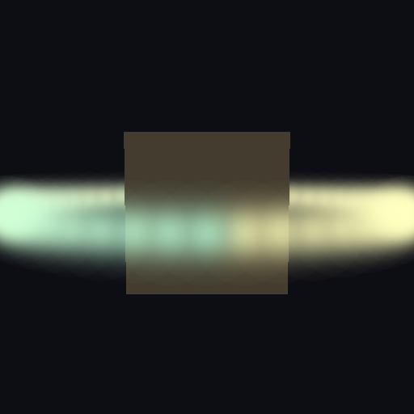
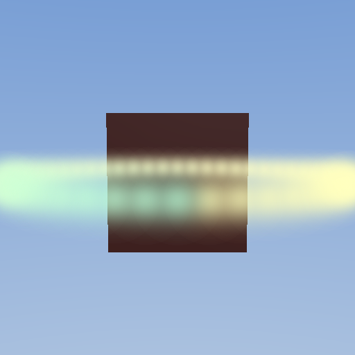
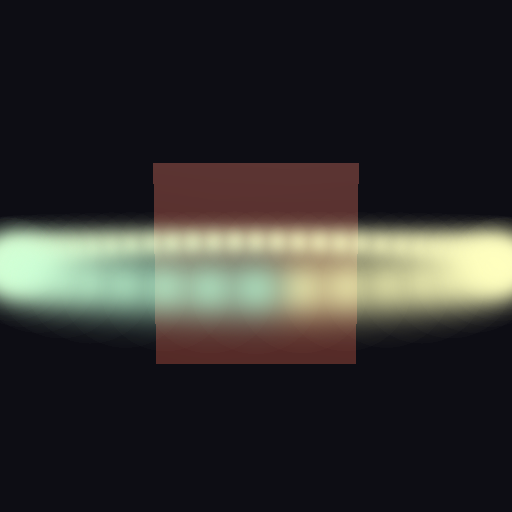
</p>
<p align="center"><em>Hybrid rendering: Gaussian splats composited with raster (left), ray tracing (center), and mesh shaders (right) — all three rendering backends support splat overlay with auto-detected splat pipeline</em></p>

<p align="center">

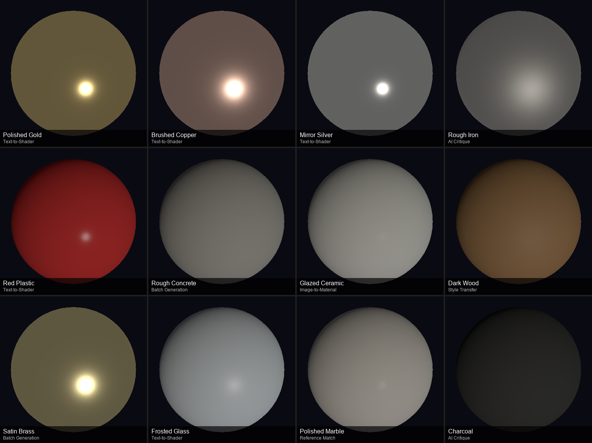
</p>
<p align="center"><em>Hello Triangle (15 lines, zero boilerplate) and AI-generated materials (text-to-shader, image-to-material, 5 providers)</em></p>

See [full gallery](docs/gallery.md) for all demos: Gaussian splatting, mesh shaders, compute, SDF, noise, autodiff, BRDF visualization, Nadrin/PBR validation, and more.

## Features

**Language**
- Declarative `surface` + `geometry` + `pipeline` blocks expand to full shader stages; `mode: deferred` auto-generates G-buffer geometry + fullscreen lighting passes from the same declarations
- **Gaussian splatting**: first-class `splat` declaration — one block generates a complete 3-stage pipeline (compute preprocess, instanced vertex, alpha-composited fragment), SH degrees 0–3, CPU depth sorting, glTF `KHR_gaussian_splatting`, **hybrid rendering** (splats composited with raster, ray tracing, or mesh shaders), interactive orbit viewers in all engines
- **OpenPBR Surface v1.1**: `import openpbr;` enables the full Adobe/ASWF material model — F82-tint metal Fresnel, energy-preserving Oren-Nayar diffuse, coat darkening, fuzz, thin-film iridescence, transmission with volume absorption, 9 composable layers, bindless uber-shader support, schedule-based quality tiers (desktop/mobile fast variants)
- Layered surfaces with `layers [base, normal_map, sheen, coat, emission, ibl]` — unified `compose_pbr_layers` compositing, energy conservation, raster + RT from one declaration
- `lighting` blocks separate illumination from material response; multi-light with shadows
- Custom `@layer` functions, compile-time `features` with `if` guards, material `properties` UBO pipeline
- Semantic types (`type strict WorldPos = vec3`) prevent coordinate-space mixing at compile time
- Algorithm/schedule separation, math-first syntax (`scalar` not `float`), auto-layout
- `for`/`while` loops, `break`/`continue`, `@[unroll]` hints, native integer arithmetic
- 160+ stdlib functions across 15 modules: BRDF, SDF, noise, color, IBL, lighting, shadow, toon, compositing, PBR pipeline, Gaussian, OpenPBR, debug...

**Compiler**
- Built-in optimizer: mem2reg, AST-level inlining, CSE, constant vector hoisting — **21.7% fewer instructions than hand-written GLSL** out of the box
- Auto-type precision: `--auto-type=relaxed` emits RelaxedPrecision for 2x mobile throughput
- `@differentiable` automatic differentiation, GLSL transpiler (`--transpile`)
- Ray tracing (`mode: raytrace`), mesh shaders (`mode: mesh_shader`), compute shaders, Gaussian splatting (`mode: gaussian_splat`), **deferred rendering** (`mode: deferred`), hybrid RT+splat / mesh+splat compositing
- **WebGPU target** (`--target wgsl --webgpu`): SPIR-V -> WGSL via naga, push constant emulation as uniform buffers, browser-ready
- Bindless rendering (`--bindless`), hot reload (`--watch`), feature permutations (`--all-permutations`)
- 39 GLSL.std.450 builtins + texture sampling (7 variants) + image queries + RT/mesh/compute intrinsics

**Tooling**
- CPU shader debugger (`--debug-run`): gdb-style REPL, NaN detection, batch JSON output, no GPU required
- Debug instrumentation: `debug_print`, `assert`, `@[debug]` blocks — zero instructions in release
- Rich debug info (`--rich-debug`): NonSemantic.Shader.DebugInfo.100 for RenderDoc step-through
- Static NaN analysis (`--warn-nan`), cost estimator, benchmark suite, A/B experiment runner

**Ecosystem**
- 5 rendering engines: Python/wgpu, C++/Vulkan, C++/Metal, Rust/ash, **WebGPU/browser** — all reflection-driven, same compiler pipeline
- **WebGPU playground** (`playground_web/`): browser-based renderer — `.lux` compiles to SPIR-V, transpiles to WGSL via naga, loads at runtime from reflection JSON. glTF PBR, IBL cubemaps, drag-and-drop `.glb`, interactive orbit camera. No embedded shaders — same pipeline as desktop.
- **Interactive scene editor** (`--editor`): Dear ImGui overlay with scene tree, material property sliders, pipeline hot-swap, transform inspector, viewport controls
- AI material authoring: text-to-shader, image-to-material, video-to-animation, 5 providers
- glTF 2.0 PBR with IBL, multi-material permutations, interactive viewers
- KHR_gaussian_splatting conformance test suite (11 official Khronos assets, 226 tests)
- PLY-to-glTF converter: coordinate transform, opacity/scale auto-detection, SH degree 0–3, round-trip verification, batch processing
- Metal backend via SPIRV-Cross, BRDF visualization tools, IBL preprocessing pipeline

## Prerequisites

- **Python 3.11+**
- **SPIR-V Tools** (`spirv-as`, `spirv-val`) — from the [Vulkan SDK](https://vulkan.lunarg.com/sdk/home) or [spirv-tools](https://github.com/KhronosGroup/SPIRV-Tools)

## Installation

```bash
git clone https://github.com/rudybear/lux.git
cd lux
pip install -e ".[dev]"
```

Verify:

```bash
python -m luxc --version
# luxc 0.1.0
```

## Quick Start

```bash
# Compile vertex + fragment from a .lux file
python -m luxc examples/hello_triangle.lux

# Compile a declarative surface pipeline
python -m luxc examples/pbr_surface.lux

# CPU-side shader debugger (no GPU needed)
python -m luxc examples/debug_playground.lux --debug-run --stage fragment

# Auto-type precision analysis
python -m luxc examples/pbr_surface.lux --auto-type=report

# Generate a shader with AI
python -m luxc --ai "frosted glass with subsurface scattering" -o generated.lux

# Compile a deferred pipeline (G-buffer vertex/fragment + lighting vertex/fragment)
python -m luxc examples/deferred_basic.lux

# Compile a Gaussian splat pipeline (compute + vertex + fragment)
python -m luxc examples/gaussian_splat.lux

# Optimize with spirv-opt
python -m luxc examples/hello_triangle.lux -O
```

See [full usage guide](docs/usage.md) for all compilation modes, watch mode, feature permutations, transpiler, and AI workflows.

## Options

```
python -m luxc input.lux [options]

Options:
  --emit-asm          Write .spvasm text files alongside .spv
  --dump-ast          Dump the AST as JSON and exit
  --no-validate       Skip spirv-val validation
  -o OUTPUT_DIR       Output directory (default: same as input)
  --pipeline NAME     Compile only the named pipeline
  --features FEAT,...   Enable compile-time features (comma-separated)
  --all-permutations    Compile all 2^N feature permutations
  --list-features       List available features and exit
  --define KEY=VALUE  Set compile-time parameter (e.g., --define max_vertices=64)
  --no-reflection     Skip .lux.json reflection metadata
  -g, --debug         Enable debug instrumentation (OpLine, OpName on locals, debug_print, assert, @[debug] blocks)
  --rich-debug        Emit NonSemantic.Shader.DebugInfo.100 for RenderDoc step-through (implies -g)
  --debug-print       Preserve debug_print/assert without full debug mode
  --assert-kill       Demote fragment invocation on assert failure (OpDemoteToHelperInvocation)
  --warn-nan          Static analysis warnings for risky float operations
  --debug-run         Launch CPU-side shader debugger (interactive REPL, no GPU required)
  --stage STAGE       Stage to debug with --debug-run (default: fragment)
  --batch             Batch mode for --debug-run (JSON output to stdout)
  --dump-vars         Trace all variable assignments (--batch)
  --check-nan         Detect NaN/Inf with source location (--batch)
  --break LINE        Set breakpoint at source line (repeatable, --batch)
  --dump-at-break     Dump all variables at breakpoint hits (--batch)
  --input FILE        Load custom input values from JSON for --debug-run
  --pixel X,Y         Debug a specific pixel (auto-computes uv, position, normal)
  --resolution WxH    Screen resolution for --pixel (default: 1920x1080)
  --set VAR=VALUE     Override a single input inline (repeatable)
  --export-inputs FILE  Export default input values to JSON
  -O, --optimize      Run spirv-opt on output binaries
  --perf              Run performance-oriented spirv-opt passes (loop unroll, strength reduction)
  --analyze           Print per-stage instruction cost analysis after compilation
  --auto-type MODE    Auto precision optimization (report=analyze only, relaxed=emit RelaxedPrecision)
  --watch             Watch input file for changes and recompile
  --watch-poll MS     Polling interval in milliseconds (default: 500)
  --bindless          Emit bindless descriptor uber-shaders
  --transpile         Transpile GLSL input to Lux
  --ai DESCRIPTION    Generate shader from natural language
  --ai-setup          Run interactive AI provider setup wizard
  --ai-provider NAME  Override AI provider (anthropic, openai, gemini, ollama, lm-studio)
  --ai-model MODEL    Model for AI generation (default: from config)
  --ai-base-url URL   Override AI provider base URL (OpenAI-compatible endpoints)
  --ai-no-verify      Skip compilation verification of AI output
  --ai-retries N      Max retry attempts for AI generation (default: 2)
  --ai-from-image IMG Generate surface material from a reference image
  --ai-modify TEXT    Modify existing material (e.g., --ai-modify "add weathering")
  --ai-batch DESC     Generate batch of materials (e.g., --ai-batch "medieval tavern")
  --ai-batch-count N  Number of materials in batch (default: AI decides)
  --ai-from-video VID Generate animated shader from video
  --ai-match-reference IMG  Iteratively match a reference image
  --ai-match-iterations N   Max refinement iterations for reference matching (default: 5)
  --ai-critique FILE  AI review of a .lux file
  --ai-skills SKILL,... Load specific skills into the AI prompt
  --ai-list-skills    List available AI skills and exit
  --version           Show version
```

## Language Reference

Types, stage blocks, declarative materials, layered surfaces, Gaussian splatting, compile-time features, ray tracing, mesh shaders, compute, debug instrumentation, auto-type, and all 39+ built-in functions.

See [full language reference](docs/language-reference.md).

## Compiler Pipeline

```
input.lux
  -> Lark Parser         (lux.lark grammar)
  -> Tree Builder         (Transformer -> AST dataclasses)
  -> Feature Stripping    (compile-time conditional removal)
  -> Import Resolver      (stdlib + local .lux modules)
  -> Surface Expander     (surface/geometry/pipeline -> stage blocks)
  -> Deferred Expander    (mode: deferred -> G-buffer + lighting passes)
  -> Splat Expander       (splat/gaussian_splat -> compute + vertex + fragment)
  -> Autodiff Expander    (@differentiable -> gradient functions)
  -> Type Checker         (resolve types, check operators, validate semantic types)
  -> Debug Stripper       (remove debug_print/assert/@[debug] in release)
  -> NaN Checker          (static warnings for risky float ops, --warn-nan)
  -> Constant Folder      (compile-time evaluation)
  -> Function Inliner     (AST-level inlining, release mode only)
  -> Dead Code Eliminator (remove unused variables/functions)
  -> CSE                  (common subexpression elimination)
  -> Auto-Type Analyzer   (fp16 range analysis: dynamic trace + static intervals + heuristics)
  -> Layout Assigner      (auto-assign location/set/binding)
  -> SPIR-V Builder       (emit .spvasm text per stage, +RelaxedPrecision decorations)
  -> spirv-as             (assemble to .spv binary)
  -> spirv-val            (validate)
  -> output: name.{vert,frag,rgen,rchit,rmiss,mesh,task,...}.spv

Alternative path (--debug-run):
  -> ... same up to Constant Folder ...
  -> CPU Interpreter      (tree-walking AST evaluator, 44+ math builtins)
  -> output: interactive REPL or JSON (--batch)
```

## Project Structure

```
luxc/            Compiler (parser, type checker, codegen, optimizer, autotype, debug)
docs/            Documentation (language ref, gallery, usage, rendering engines)
examples/        Example .lux shaders
tests/           Test suite (1424+ tests)
playground/      Python/wgpu rendering engine + screenshot tests
playground_cpp/  C++/Vulkan + Metal rendering engines
playground_rust/ Rust/Vulkan rendering engine
playground_web/  WebGPU/browser rendering engine (TypeScript + Vite)
```

See [full project structure](docs/project-structure.md) for the complete directory tree.

## Examples

| Example | Features |
|---------|----------|
| `hello_triangle.lux` | Vertex + fragment, per-vertex color |
| `pbr_basic.lux` | Blinn-Phong, Fresnel, uniforms, push constants, textures |
| `pbr_surface.lux` | Declarative `geometry` + `surface` + `pipeline` |
| `scheduled_pbr.lux` | Algorithm/schedule separation, ACES tonemap |
| `sdf_shapes.lux` | SDF stdlib: sphere, box, torus, smooth union |
| `procedural_noise.lux` | Noise stdlib: FBM domain warping + Voronoi |
| `differentiable.lux` | `@differentiable` + auto-generated gradient |
| `rt_pathtracer.lux` | Declarative RT: surface + environment + `mode: raytrace` |
| `rt_manual.lux` | Hand-written raygen + closest_hit + miss |
| `brdf_gallery.lux` | Lambert, GGX microfacet, PBR metallic, clearcoat |
| `colorspace_demo.lux` | HSV conversion, contrast, saturation, gamma |
| `texture_demo.lux` | UV tiling, rotation, triplanar weight visualization |
| `autodiff_demo.lux` | Wave function + derivative visualization |
| `advanced_materials_demo.lux` | Transmission, iridescence, dispersion, volume attenuation |
| `gltf_pbr.lux` | glTF 2.0 PBR: tangent normal mapping, metallic-roughness, IBL cubemaps, multi-scattering |
| `gltf_pbr_rt.lux` | Ray traced glTF PBR: same material model with RT stages |
| `gltf_pbr_layered.lux` | Layered surface: unified raster + RT + mesh shader from one surface declaration |
| `cartoon_toon.lux` | Custom `@layer` function: cel-shading + rim lighting (raster + RT) |
| `lighting_demo.lux` | Multi-light: directional, point, spot lights with PBR |
| `multi_light_demo.lux` | Multi-light with shadows: N-light loop, LightData SSBO, shadow maps |
| `ibl_demo.lux` | Image-based lighting showcase: specular + diffuse IBL |
| `math_builtins_demo.lux` | Built-in function visualizer: sin, smoothstep, fract, etc. |
| `viz_transfer_functions.lux` | BRDF transfer function graphs: Fresnel, NDF, geometry, diffuse curves |
| `viz_brdf_polar.lux` | Polar lobe visualization: GGX, Lambert, sheen, PBR composite |
| `viz_param_sweep.lux` | Parameter sweep heatmaps: roughness x metallic, roughness x NdotV |
| `viz_furnace_test.lux` | White furnace test: energy conservation with hemisphere integration |
| `viz_layer_energy.lux` | Per-layer energy breakdown: stacked area chart of BRDF contributions |
| `compute_mandelbrot.lux` | Compute shader: 64-iteration Mandelbrot with `for` loop + `break`, storage image output |
| `compute_histogram.lux` | Shared memory: per-workgroup histogram with `shared uint[256]` + `atomic_add` |
| `compute_reduction.lux` | Parallel reduction: barrier-synchronized tree sum with shared memory |
| `debug_features_demo.lux` | Debug instrumentation: `debug_print`, `assert`, `@[debug]` blocks, semantic types, `any_nan`/`any_inf` |
| `gaussian_splat.lux` | Gaussian splatting: `splat` declaration, 3-stage pipeline (compute + vertex + fragment) |
| `openpbr_reference.lux` | OpenPBR ASWF reference: car paint (coat + specular, exact values from OpenPBR viewer) |
| `openpbr_ref_aluminum.lux` | OpenPBR ASWF reference: brushed aluminum (metalness=1, specular color tint) |
| `openpbr_ref_pearl.lux` | OpenPBR ASWF reference: pearl (coat + thin-film iridescence) |
| `openpbr_ref_velvet.lux` | OpenPBR ASWF reference: velvet (fuzz layer, dark base) |
| `deferred_basic.lux` | Deferred rendering: `mode: deferred` auto-generates G-buffer + lighting passes from standard glTF PBR declarations |
| `debug_playground.lux` | CPU debugger playground: PBR with intentional NaN trap, 8 labeled stages for breakpoint exploration |

## Running Tests

```bash
pip install -e ".[dev]"
python -m pytest tests/ -v
# 1424+ tests
```

Requires `spirv-as` and `spirv-val` on PATH for end-to-end tests.

## Assets

The `assets/` directory contains glTF 2.0 sample models and HDR environment maps used for rendering tests and demos. These are tracked via Git LFS.

**glTF models** — official [Khronos glTF Sample Assets](https://github.com/KhronosGroup/glTF-Sample-Assets):

| Asset | Source | Purpose |
|-------|--------|---------|
| `DamagedHelmet.glb` | Khronos glTF Sample Assets | Primary PBR test model (normal maps, metallic-roughness, emission) |
| `MetalRoughSpheres.glb` | Khronos glTF Sample Assets | Metallic-roughness parameter sweep grid |
| `MetalRoughSpheresNoTextures.glb` | Khronos glTF Sample Assets | Parameter-only variant (no textures) |
| `ClearCoatTest.glb` | Khronos glTF Sample Assets | `KHR_materials_clearcoat` extension test |
| `SheenChair.glb` | Khronos glTF Sample Assets | `KHR_materials_sheen` extension test |
| `TransmissionTest.glb` | Khronos glTF Sample Assets | `KHR_materials_transmission` extension test |

**HDR environment maps:**

| Asset | Purpose |
|-------|---------|
| `pisa.hdr` | Pisa courtyard IBL environment (diffuse + specular) |
| `neutral.hdr` | Neutral studio IBL environment |

**Preprocessed IBL data** (`assets/ibl/`): pre-filtered specular cubemaps, irradiance cubemaps, and BRDF integration LUTs generated by `python -m playground.preprocess_ibl`.

## Design Decisions

| Decision | Choice | Rationale |
|----------|--------|-----------|
| `scalar` not `float` | Mathematical vocabulary | Reads naturally in equations |
| No layout qualifiers | Auto-assigned by order | Eliminates #1 source of GLSL bugs |
| `builtin_position` | Explicit naming | No magic globals, greppable |
| `:` type annotations | Rust-like syntax | LLMs generate this reliably |
| One file, multi-stage | `vertex {}` / `fragment {}` | Natural unit of compilation |
| Explicit types | No inference | LLMs produce more correct code |
| Declarative surfaces | `surface` + `geometry` + `pipeline` | Separates material math from plumbing |
| Schedule separation | `schedule` blocks | Same material, different quality targets |
| Function inlining | No SPIR-V OpFunctionCall | Simplifies codegen, stdlib works everywhere |
| Forward-mode autodiff | `@differentiable` annotation | Natural for shader parameter gradients |
| Structured loops | `for`/`while` with `OpLoopMerge` | `@[unroll]` hint for GPU-friendly unrolling, `break`/`continue` for early exit |
| First-class `splat` | `splat` + `mode: gaussian_splat` | 3DGS is a rendering primitive, not a hack — one declaration, three stages |
| Direct AST to SPIR-V | No IR | Simpler, faster path to working output |

## License

MIT
