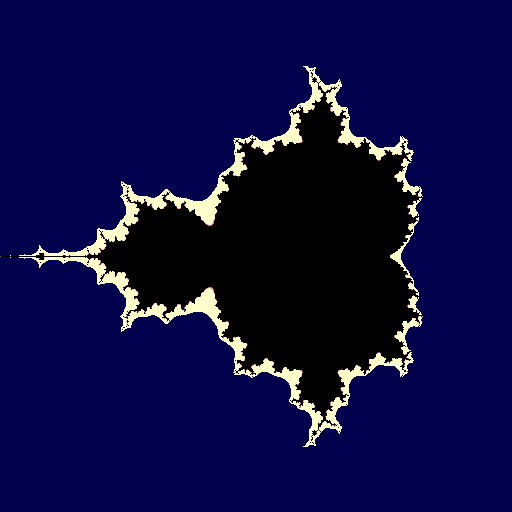

# Gallery

### glTF PBR with IBL — Ray Traced

Full glTF 2.0 PBR rendering with ray tracing — tangent-space normal mapping, metallic-roughness workflow, IBL with pre-filtered specular cubemap, compile-time feature permutations, and a single `surface` declaration that compiles to both raster and RT pipelines.

<p align="center"></p>

```lux
import brdf;
import color;
import ibl;
import texture;

features {
    has_normal_map: bool,
    has_emission: bool,
}

surface GltfPBR {
    sampler2d base_color_tex,
    sampler2d normal_tex if has_normal_map,
    sampler2d metallic_roughness_tex,
    sampler2d occlusion_tex,
    sampler2d emissive_tex if has_emission,

    layers [
        base(albedo: srgb_to_linear(sample(base_color_tex, uv).xyz),
             roughness: sample(metallic_roughness_tex, uv).y,
             metallic: sample(metallic_roughness_tex, uv).z),
        normal_map(map: sample(normal_tex, uv).xyz) if has_normal_map,
        emission(color: srgb_to_linear(sample(emissive_tex, uv).xyz)) if has_emission,
    ]
}

lighting SceneLighting {
    samplerCube env_specular,
    samplerCube env_irradiance,
    sampler2d brdf_lut,

    properties Light {
        light_dir: vec3 = vec3(0.0, -1.0, 0.0),
        view_pos: vec3 = vec3(0.0, 0.0, 3.0),
    },

    layers [
        directional(direction: Light.light_dir,
                    color: vec3(1.0, 0.98, 0.95)),
        ibl(specular_map: env_specular, irradiance_map: env_irradiance,
            brdf_lut: brdf_lut),
    ]
}

pipeline GltfRT {
    mode: raytrace,
    surface: GltfPBR,
    lighting: SceneLighting,
    environment: HDRSky,
    schedule: HighQuality,
}
```

### Mesh Shaders — Meshlet-Based GPU-Driven Rendering

Meshlet-based geometry processing via `VK_EXT_mesh_shader` — the same `surface` declaration compiles to raster, ray tracing, *and* mesh shader pipelines. Engine queries hardware limits, builds meshlets, and compiles with matching `--define` parameters. C++ and Rust engines only.

<p align="center"></p>

```lux
pipeline GltfMesh {
    mode: mesh_shader,
    geometry: StandardMesh,
    surface: GltfPBR,
    schedule: HighQuality,
}
```

```bash
luxc gltf_pbr_layered.lux --pipeline GltfMesh --features has_emission \
    --define max_vertices=64 --define max_primitives=124 --define workgroup_size=32
```

### Gaussian Splatting — First-Class 3DGS Rendering Primitive

First-class Gaussian splatting via the `splat` declaration — one block generates a complete 3-stage pipeline: compute preprocess (projection, 3D→2D covariance via Jacobian, SH evaluation up to degree 3), instanced vertex shader (depth-sorted quad rendering), and fragment shader (2D Gaussian kernel with alpha cutoff and premultiplied alpha compositing). Supports SH degrees 0–3 (1/4/9/16 coefficients), CPU depth sorting, and `KHR_gaussian_splatting` glTF extension for interop. All three engines (C++/Vulkan, Rust/ash, Python/numpy) render Gaussian splats with interactive orbit cameras. Tools for `.ply` ↔ `.glb` conversion included.

<p align="center">


</p>

```lux
splat GaussianCloud {
    sh_degree: 0,
    kernel: ellipse,
    color_space: srgb,
    sort: camera_distance,
    alpha_cutoff: 0.004,
}

pipeline SplatViewer {
    mode: gaussian_splat,
    splat: GaussianCloud,
}
```

```bash
# Compile + render
python -m luxc examples/gaussian_splat.lux
python -m tools.generate_test_splats tests/assets/test_splats.glb
playground_cpp/build/Release/lux-playground.exe --scene tests/assets/test_splats.glb --pipeline examples/gaussian_splat --interactive
```

### Compute Shaders — GPU General-Purpose Computation

Standalone `compute` stage for data-parallel GPU work — `for`/`while` loops with `break`/`continue`, native integer arithmetic, workgroup shared memory with atomic operations, SSBO read/write, storage image output, configurable workgroup sizes, and `barrier()` synchronization.

<p align="center">


</p>

```lux
// Mandelbrot set — 64-iteration loop with early escape
compute {
    storage_image output_img;

    fn main() {
        let gid: uvec3 = global_invocation_id;
        let cx: scalar = -0.5 + (gid.x / 512.0 - 0.5) * 3.0;
        let cy: scalar = (gid.y / 512.0 - 0.5) * 3.0;
        let zx: scalar = cx;
        let zy: scalar = cy;

        for (let i: int = 0; i < 64; i = i + 1) {
            if (zx * zx + zy * zy > 4.0) { break; }
            let new_zx: scalar = zx * zx - zy * zy + cx;
            zy = 2.0 * zx * zy + cy;
            zx = new_zx;
        }

        let color: vec4 = vec4(r, g, b, 1.0);
        image_store(output_img, gid.xy, color);
    }
}
```

```lux
// Per-workgroup histogram with shared memory + atomics
compute {
    shared histogram: uint[256];
    storage_buffer data: uint;

    fn main() {
        histogram[local_invocation_index] = 0;
        barrier();
        let val: uint = data[global_invocation_id.x];
        let old: uint = atomic_add(histogram[val], 1);
    }
}
```

```bash
luxc compute_mandelbrot.lux --define workgroup_size_x=16 --define workgroup_size_y=16
# Wrote compute_mandelbrot.comp.spv
```

### Cartoon / Toon Shader — Custom `@layer`

User-defined layers via `@layer` annotation — cel-shading with quantized NdotL and rim lighting, applied to glTF PBR models. One `@layer fn cartoon(...)` plugs into the standard layer compositing pipeline.

<p align="center"></p>

```lux
import toon;

surface ToonSurface {
    sampler2d albedo_tex,
    layers [
        base(albedo: sample(albedo_tex, uv).xyz, roughness: 0.8, metallic: 0.0),
        cartoon(bands: 4.0, rim_power: 3.0, rim_color: vec3(0.3, 0.3, 0.5)),
    ]
}
```

### Ray Tracing

Real-time ray traced sphere with barycentric shading and sky gradient — compiled from a single `.lux` file to three SPIR-V stages (raygen, closest-hit, miss).

<p align="center"></p>

```
raygen {
    acceleration_structure tlas;
    ray_payload payload: vec4;
    storage_image output_image;

    fn main() {
        let pixel: uvec3 = launch_id;
        let origin: vec3 = vec3(0.0, 0.0, 2.0);
        let direction: vec3 = normalize(vec3(px * 2.0 - 1.0, py * 2.0 - 1.0, -1.0));
        trace_ray(tlas, 0, 255, 0, 0, 0, origin, 0.001, direction, 1000.0, 0);
        image_store(output_image, vec2(pixel.x, pixel.y), payload);
    }
}
```

### PBR Surface

Declarative material pipeline — just declare geometry, surface BRDF, and pipeline. The compiler generates vertex + fragment stages automatically.

<p align="center"></p>

```
import brdf;

surface TexturedPBR {
    sampler2d albedo_tex,
    brdf: pbr(sample(albedo_tex, frag_uv).xyz, 0.5, 0.0),
}

pipeline PBRForward {
    geometry: StandardMesh,
    surface: TexturedPBR,
}
```

### SDF Shapes

Signed distance field primitives with smooth boolean operations — sphere, box, and torus combined with smooth union.

<p align="center"></p>

```
import sdf;

let d_sphere: scalar = sdf_sphere(p, 0.8);
let d_box: scalar = sdf_box(sdf_translate(p, vec3(1.2, 0.0, 0.0)), vec3(0.5));
let d_torus: scalar = sdf_torus(sdf_translate(p, vec3(-1.2, 0.0, 0.0)), 0.5, 0.2);
let d_final: scalar = sdf_smooth_union(sdf_smooth_union(d_sphere, d_box, 0.3), d_torus, 0.3);
```

### Procedural Noise

Domain-warped FBM noise with Voronoi cell overlay — organic, natural-looking textures from pure math.

<p align="center"></p>

```
import noise;

let n1: scalar = fbm2d_4(p, 2.0, 0.5);
let n2: scalar = fbm2d_4(p + vec2(5.2, 1.3), 2.0, 0.5);
let warped: scalar = fbm2d_4(p + vec2(n1, n2) * 2.0, 2.0, 0.5);
let vor: vec2 = voronoi2d(uv * 6.0);
```

### Automatic Differentiation

Mark any function with `@differentiable` and the compiler generates its derivative. Top: wave function, bottom: auto-generated gradient.

<p align="center"></p>

```
@differentiable
fn wave(x: scalar) -> scalar {
    return sin(x * 6.28318) * 0.5 + x * x * 0.3;
}

let f_val: scalar = wave(x);
let f_grad: scalar = wave_d_x(x);  // auto-generated derivative
```

### Colorspace Transforms

HSV rainbow with artistic controls — contrast, saturation, hue shift, and gamma correction from the colorspace stdlib.

<p align="center"></p>

```
import colorspace;

let rainbow: vec3 = hsv_to_rgb(vec3(hue, sat, val));
let adjusted: vec3 = hue_shift(saturate_color(rainbow, 1.5), 0.15);
let corrected: vec3 = gamma_correct(rainbow, 2.2);
```

### Hello Triangle

The simplest Lux program — per-vertex colors, zero boilerplate. The entire shader is 15 lines.

<p align="center"></p>

```
vertex {
    in position: vec3;
    in color: vec3;
    out frag_color: vec3;

    fn main() {
        frag_color = color;
        builtin_position = vec4(position, 1.0);
    }
}
```

### Real-World Optimization Validation — Nadrin/PBR

End-to-end validation against [Nadrin/PBR](https://github.com/Nadrin/PBR), a real C++/Vulkan PBR renderer with 3 graphics pipelines + 1 compute pipeline. All 4 shaders (PBR, skybox, tonemap, SPBRDF) hand-converted to native Lux, compiled to SPIR-V, and benchmarked with Vulkan timestamp queries on an NVIDIA RTX PRO 6000 Blackwell.

| Metric | Result |
|--------|--------|
| Visual parity | Pixel-perfect (PSNR = infinity, SSIM = 1.0) across all optimization levels |
| Default Lux vs GLSL | **-21.7%** fewer instructions (1,088 vs 1,390) — **no spirv-opt needed** |
| PBR fragment shader | **424** instructions (GLSL: 533, **-20.5%**) |
| With spirv-opt -O | Same instruction count — spirv-opt finds nothing left to optimize |
| GPU runtime | Equivalent — NVIDIA driver JIT normalizes shader performance |

Lux's built-in optimizer (mem2reg, AST-level inlining, CSE, constant vector hoisting) produces smaller SPIR-V than hand-written GLSL compiled with glslangValidator — without any external optimization passes. The PBR fragment shader went from 845 instructions (pre-optimization) to 424, a **49.8% reduction**. See the full [optimization protocol](../projects/nadrin-pbr/optimization/protocol.md) and [optimization wisdom](../projects/nadrin-pbr/optimization/wisdom.md) for methodology and principles.

### BRDF & Layer Visualization

GPU-rendered visualization of BRDF functions — Fresnel curves, NDF distributions, polar lobe plots, parameter sweeps, energy conservation furnace tests, and per-layer energy breakdowns. All visualizations are self-contained `.lux` fragment shaders rendered as fullscreen quads.

```bash
# Compile and render all 5 visualization shaders
python -m tools.visualize_brdf --composite

# Render individual panels
python -m tools.visualize_brdf --shader transfer
python -m tools.visualize_brdf --shader polar
python -m tools.visualize_brdf --shader sweep
python -m tools.visualize_brdf --shader furnace
python -m tools.visualize_brdf --shader layers
```

| Shader | Content |
|--------|---------|
| `viz_transfer_functions.lux` | 2x3 grid: Fresnel, GGX NDF, Smith G, Charlie NDF, Lambert vs Burley, conductor Fresnel |
| `viz_brdf_polar.lux` | 2x2 polar lobe plots: GGX specular, Lambert diffuse, sheen, PBR composite |
| `viz_param_sweep.lux` | Viridis heatmaps: roughness x metallic, roughness x NdotV |
| `viz_furnace_test.lux` | White furnace test: hemisphere integration with 16 unrolled samples |
| `viz_layer_energy.lux` | Stacked area chart: per-layer energy (diffuse, specular, coat, sheen) vs viewing angle |

### AI-Generated Materials

Generate physically-based materials from text, images, or video. The AI pipeline produces compilable Lux code with automatic verification, retry on failure, and structured critique. Five providers supported (Anthropic, OpenAI, Gemini, Ollama, LM Studio).

<p align="center"></p>

```bash
luxc --ai "polished gold"                              # text-to-shader
luxc --ai-from-image copper_pipe.jpg                    # image-to-material
luxc --ai-modify "add weathering" brass.lux             # style transfer
luxc --ai-batch "medieval tavern" -o tavern/            # scene batch (5+ materials)
luxc --ai-critique material.lux                         # validation & review
luxc --ai-match-reference marble.png                    # iterative render-compare
```

Every generated material passes the compiler's parse, type-check, and energy-conservation validation before output. Materials are grounded against a 58-entry PBR reference database (physically measured F0, roughness, IOR values). The AI skill system loads domain expertise (PBR authoring, layer composition, optimization, debugging) into prompts for better results.

See [AI.md](../AI.md) for the complete AI feature reference with pipeline diagrams, generated code samples, and CLI output examples.

### Native GPU Playgrounds

Four rendering backends — Python/wgpu, C++/Vulkan, C++/Metal, Rust/ash — all driven by the same reflection JSON from the Lux compiler:

```bash
# Python (wgpu)
python -m playground.engine --scene sphere --pipeline shadercache/pbr_surface

# C++ (Vulkan)
cd playground_cpp && cmake -B build && cmake --build build --config Release
./build/Release/lux-playground --pipeline shadercache/gltf_pbr --scene path/to/model.glb

# C++ (Metal — macOS only)
cd playground_cpp && cmake -B build-metal -DLUX_METAL=ON && cmake --build build-metal
./build-metal/lux-playground-metal --scene path/to/model.glb

# Rust (Vulkan)
cd playground_rust && cargo build --release
./target/release/lux-playground --pipeline shadercache/gltf_pbr --scene path/to/model.glb

# Ray tracing (C++ and Rust, Vulkan only)
./build/Release/lux-playground --mode rt shadercache/rt_manual
```

All four engines support reflection-driven descriptor binding, glTF loading, cubemap textures, and IBL. The Metal backend transpiles SPIR-V to MSL via SPIRV-Cross at runtime.

### Platform & Feature Matrix

| Feature | Python / wgpu | C++ / Vulkan | C++ / Metal | Rust / Vulkan |
|---------|:---:|:---:|:---:|:---:|
| **Platforms** | Win, Linux, macOS | Win, Linux | macOS | Win, Linux |
| **Rasterization** | yes | yes | yes | yes |
| **Compute shaders** | yes | yes | yes | yes |
| **Mesh shaders** | — | yes | yes (Metal 3) | yes |
| **Ray tracing** | — | yes | — | yes |
| **Gaussian splatting** | yes (CPU) | yes | — | yes |
| **Bindless descriptors** | — | yes | — | yes |
| **glTF 2.0 loading** | yes | yes | yes | yes |
| **IBL (specular + irradiance)** | yes | yes | yes | yes |
| **Multi-material permutations** | yes | yes | yes | yes |
| **Material properties UBO** | yes | yes | yes | yes |
| **Multi-light + shadows** | yes | yes | yes | yes |
| **Interactive viewer** | yes (splat) | yes | yes | yes |
| **Headless PNG output** | yes | yes | yes | yes |
| **Shader input** | SPIR-V | SPIR-V | SPIR-V → MSL | SPIR-V |
| **Windowing** | — | GLFW | GLFW | winit |
